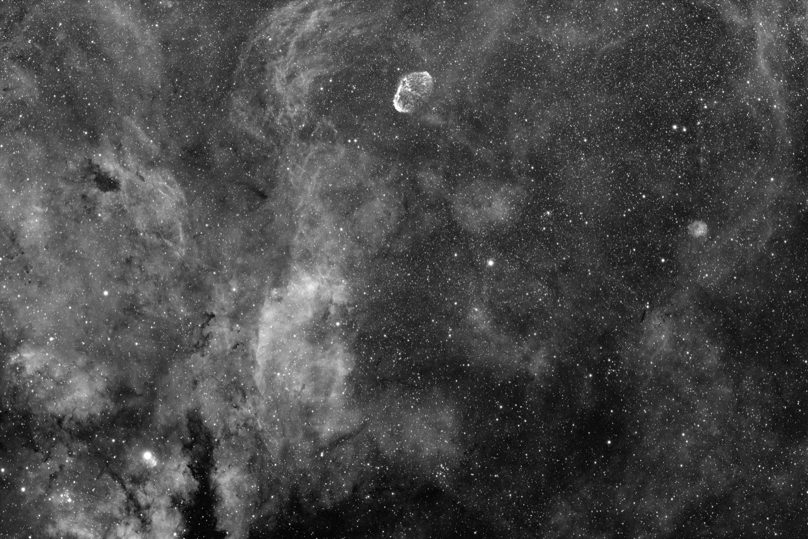
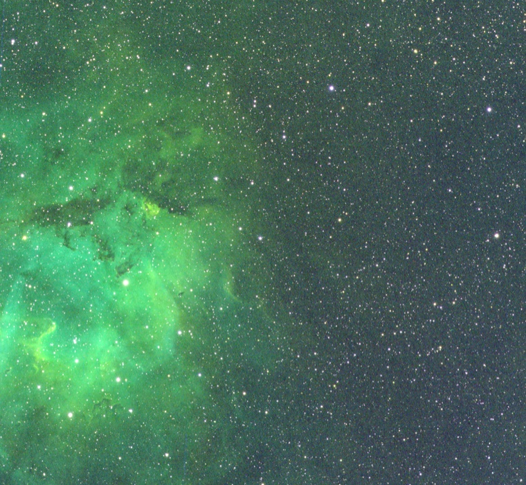
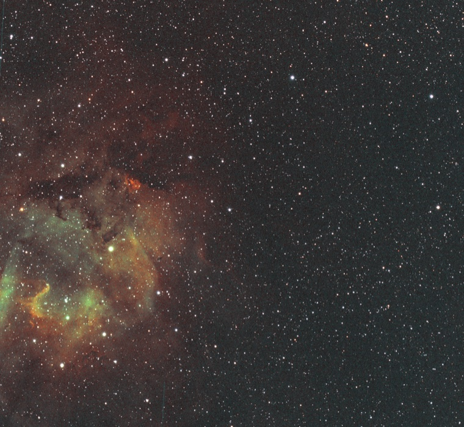

# seiza (星座)

[](Cargo.toml)

Star detection, WCS fitting, plate solving — hinted and blind — and calibrated
batch/live image stacking for astrophotography, in Rust. Stacking includes
linear FITS output and RGB, LRGB, and narrowband composition from mono stacks.
Built to power object overlays and astrometric features in
[tenrankai](https://github.com/theatrus/tenrankai) and
[PSF Guard](https://github.com/theatrus/psf-guard).

It is fast. A typical hinted solve of a real telescope frame finishes in
0.2–0.4 seconds, and a blind solve — no position hint at all — takes about
half a second with the prebuilt index. In side-by-side benchmarks seiza
matched or beat ASTAP on every workload we tested, up to 19x faster on blind
solves. The numbers and caveats are in [Performance](#performance).

**Try it without installing anything:** go to [seiza.fyi](https://seiza.fyi),
upload an image, and get a solution and object overlay in your browser. The
site runs [seiza-server](https://github.com/theatrus/seiza-server); the CLI
can submit to the same server with `seiza worker --server`.

## Install

- **Windows** — download the MSI installer from the
  [releases](https://github.com/theatrus/seiza/releases). It puts `seiza` on
  your `PATH` and offers to download catalogs for you when it finishes.
- **Fedora / Ubuntu** — install the RPM or deb from the same releases page.
- **Python** — `pip install seiza` for the library with binary wheels.
- **Anywhere with Rust** — `cargo install seiza-cli` (requires Rust 1.89 or
  newer; see [MSRV](#minimum-supported-rust-version)).

Building from source requires Rust 1.89 or newer. Repository checkouts pin
Rust 1.97.1 through `rust-toolchain.toml` so local builds and CI use the same
compiler, formatter, and linter.

## Ways to use it

- **As N.I.N.A.'s plate solver** — seiza answers ASTAP's command line, so
  select ASTAP in N.I.N.A. and point it at `seiza.exe`. No plugin needed.
  [Steps below](#use-with-nina-astap-compatible-mode).
- **As Siril's plate solver** — seiza also answers astrometry.net's
  `solve-field` command line. Point Siril's astrometry.net path at a copy
  of seiza named `solve-field` and solve as usual, SIP distortion
  included. [Steps below](#use-with-siril-solve-field-compatible-mode).
- **In [Tenrankai](https://github.com/theatrus/tenrankai)** — its gallery
  server uses seiza for astrometric solutions and object overlays.
- **In [PSF Guard](https://github.com/theatrus/psf-guard)** — seiza provides
  solved WCS and catalog context for image-quality and spatial analysis.
- **In a browser** — [seiza.fyi](https://seiza.fyi) lets you upload an image
  for a hosted solution and object overlay, with nothing to install.
- **From your own application** — run `seiza worker` to keep the catalogs
  and blind index open between solves, and send it one JSON request per
  line. It can also forward solves to a seiza-server, local or hosted.
  [Wire protocol](docs/design/worker-protocol.md).
- **From Python** — `pip install seiza`: detection, hinted and blind
  solving with optional SIP distortion, WCS transforms, FITS WCS keyword
  output, verified catalog downloads, and native batch/live image stacking
  with calibration-master construction, robust background extraction,
  parameterized display stretching, and NumPy support. Binary wheels for Linux
  x86_64 and aarch64, macOS, and Windows cover every CPython from 3.9 up, with
  type stubs included ([seiza-py](seiza-py/README.md)).
- **From native applications** — [`seiza-cabi`](seiza-cabi/README.md) exposes
  FITS/raster rendering, robust background fitting and correction, incremental
  image stacking, solving, overlays, and catalog setup through one generated C
  header for Swift, .NET, C, and C++ consumers.
- **From Rust** — use the crates directly: [`seiza`](seiza/README.md)
  (detection, WCS, solving, catalogs),
  [`seiza-fits`](seiza-fits/README.md) (FITS reading and linear `f32` writing),
  [`seiza-background`](seiza-background/README.md) (robust gradient models),
  [`seiza-deconvolution`](seiza-deconvolution/README.md) (experimental,
  conservative linear-image restoration),
  [`seiza-stretch`](seiza-stretch/README.md) (parameterized display curves),
  [`seiza-stacking`](seiza-stacking/README.md) (linear calibration,
  registration, and additive live stacking),
  [`seiza-download`](seiza-download/README.md) (catalog download and
  caching), [`seiza-satellites`](seiza-satellites/README.md) (single-exposure
  satellite track prediction), and [`seiza-sources`](seiza-sources/README.md)
  (raw upstream data for custom catalog builds).

## Quick start

Download the ready-made catalogs once, then solve:

```
cargo install seiza-cli
seiza download-data prebuilt --output data       # SHA-256-verified from downloads.seiza.fyi
seiza solve-blind image.jpg --data data --min-scale 0.5 --max-scale 15
seiza solve image.fits --data data --scale 1.26 --objects data
seiza solve image.fits --data data --scale 1.26 --satellites-celestrak --annotate tracks.png
seiza catalog object --data data "Andromeda Galaxy"
seiza catalog objects --data data --ra 10.6848 --dec 41.2691 --radius 3 --format json
seiza catalog star --data data "TYC 5949-2777-1" --format json
seiza master bias bias/*.fits --output master-bias.fits
seiza stack light-001.fits light-002.fits light-003.fits --output stack.fits \
  --preview stack.png --report stack-report.json
seiza background stack.fits --output stack-bg.fits \
  --model-output background.fits --diagnostics background.json
seiza deconvolve stack-bg.fits --output stack-light-dc.fits \
  --psf-fwhm 3.1 --iterations 4 --amount 0.35
```

`--data` takes a file or a directory: a directory picks the right catalog
automatically (the deepest star catalog present, the blind pattern index
when one is there). After `seiza setup`, every `--data` and `--index` can
be omitted entirely — the standard catalog locations are searched.

Satellite overlays are opt-in and apply only to one shutter-open exposure,
not a stack. The solver reads `DATE-BEG`/`DATE-END`, `DATE-AVG` plus
`EXPTIME`, `DATE-OBS` plus `EXPTIME`, or a lone `DATE-END` plus `EXPTIME`, and
standard `OBSGEO-*` observer coordinates from FITS. Explicit `--time`,
`--exposure-seconds`, and `--observer-lat/--observer-lon` remain available.
The annotation is a predicted path, not a claim that a trail was detected.
For historical images, the `seiza-satellites` library resolves epoch-
appropriate TLEs from its durable cache, the Seiza rolling mirror, or the
public IAU SatChecker fallback. Current CelesTrak and historical responses
share a cache-only-replayable history with a configurable 5 GiB default cap.
See the [satellite track design](docs/design/satellite-tracks.md).
Mirror operators should follow the
[satellite publication runbook](docs/SATELLITE_MIRROR.md).

Not sure which catalogs you need? Run the guided setup — the same one the
Windows installer offers, available on every platform:

```text
seiza setup
```

It walks you through use-case-based choices: lightweight hinted solving,
denser Gaia solving, deep blind solving, or the complete bundle. Every choice
includes object search, Solar System objects, active transients, and at least
one plate-solving catalog. All downloads are versioned and SHA-256 verified.

Set `SEIZA_CATALOG_DIR` to choose the default setup and ASTAP-compatible
catalog directory. The all-users Windows installer sets it system-wide to the
shared `%ProgramData%\Seiza\catalogs` directory.

Solving many images from your own application? Start a worker so the
catalogs and blind index stay open instead of being reloaded for every solve:

```text
seiza worker --data data --index data
```

Send it one JSON request per line on stdin; it writes one response per line
on stdout, takes FITS or normal image paths, and exits cleanly at EOF. The
full request and response format is in
[the worker protocol](docs/design/worker-protocol.md).

The same worker can send solves to a
[`seiza-server`](https://github.com/theatrus/seiza-server) instead of solving
locally — your own, or the hosted one at [seiza.fyi](https://seiza.fyi). It
converts each FITS to a lossless 8-bit PNG before upload to keep transfers
small:

```text
seiza worker --server http://solver-host:8080
```

If the server needs an API key, pass `--server-token` or set
`SEIZA_SERVER_TOKEN`. To upload the original FITS instead of the PNG (for
example, to preserve headers or full bit depth), pass `--server-upload fits`.
Remote solves give up after five minutes; change that with
`--server-timeout SECONDS`. Local and remote workers speak the same JSON
protocol, so your application code does not change.

## Image stacking

`seiza stack` calibrates and registers linear FITS light frames, optionally
applies global or tiled local normalization, and integrates them with online
delta-sigma rejection. Differently sized or cropped frames are mapped onto the
first frame's fixed output grid. Frames acquired after a German-equatorial-mount
meridian flip are handled automatically: a transform near 180 degrees is
accepted under the normal rotation tolerance and the pixels are rotated back
onto the reference orientation before integration.

Color remains color. Three-plane FITS inputs are stacked as linear RGB; raw
one-shot-color frames carrying `BAYERPAT` are calibrated in their native CFA
sampling and then debayered. Registration detects stars from a luminance view,
but the resulting transform, per-channel normalization, rejection, and
accumulation retain all three channels. The result is an unstretched
three-plane `float32` RGB FITS, and `--preview` produces an RGB display image.

```text
seiza stack lights/*.fits --output stack.fits \
  --bias master-bias.fits --dark master-dark.fits --flat master-flat.fits \
  --normalization local --preview stack.png --report stack-report.json
```



*Eight 300-second H-alpha frames stacked on the first frame's pixel grid. The
JPEG uses a display-only stretch; the stack itself remains linear `f32` FITS.*

The Rust crate and Python wheel expose the same incremental `LiveStacker`
engine. See the [CLI stacking guide](seiza-cli/README.md#image-stacking),
[Python API](seiza-py/README.md#image-stacking), and
[stacking design](docs/design/image-stacking.md).

### Light deconvolution (experimental)

`seiza deconvolve` provides a deliberately restrained classical restoration
experiment for calibrated/stacked linear FITS images. Supply a stellar FWHM in
pixels; Seiza applies four damped Richardson-Lucy iterations by default and
blends 35% of the result back into the input while preserving per-channel flux.

```text
seiza deconvolve stack-bg.fits --output stack-light-dc.fits \
  --psf-fwhm 3.1 --iterations 4 --amount 0.35
```

This is an explicit symmetric-Gaussian PSF model, not blind sharpening or a
learned reconstruction. Use it before display stretching and inspect for noise,
rings, and field-dependent failures. Raw Bayer mosaics are rejected. See the
[`seiza-deconvolution` crate](seiza-deconvolution/README.md) and
[design note](docs/design/deconvolution.md) for the guardrails and limitations.
The [AstroBin corpus trial](docs/benchmarks/2026-07-deconvolution-corpus.md)
shows four before/after examples with measured PSF and background changes; the
[model-based restoration plan](docs/design/ml-restoration-training.md) explains
how synthetic degradations and registered expert pairs could train a later ML
operation without treating attractive edits as ground truth.

### Automatic background extraction

`seiza background` estimates a smooth gradient from robust sample windows in
a linear mono or RGB FITS image. The default quadratic model is fit per channel
at shared, deterministically selected positions; locally noisy samples and
samples inconsistent with the fitted surface are rejected. Output remains
linear `float32` and retains a valid input WCS.

```text
seiza background stack.fits --output corrected.fits \
  --model-output background.fits --diagnostics background.json

# A conservative plane for a simple additive gradient
seiza background stack.fits --output corrected.fits --degree 1

# Multiplicative illumination correction
seiza background stack.fits --output corrected.fits --mode divide
```

Fitting itself retains only compact samples and coefficients. Correction can
run in place; a full-resolution model is allocated only when requested. Rust
and Python expose the same fit/apply split and accept an exclusion mask for
extended structures. See the
[background-extraction design](docs/design/background-extraction.md) for the
ADBE-inspired sampling strategy, correction math, memory behavior, and limits.

### Color from mono stacks

Mono stacks can be turned into RGB/LRGB or narrowband quick looks
without changing the linear stack accumulator:

```text
seiza color lrgb --luminance l.fits --red r.fits --green g.fits --blue b.fits \
  --output lrgb.fits --preview lrgb.png

seiza color narrowband --ha ha.fits --oiii oiii.fits --sii sii.fits \
  --palette sho --output sho.fits --preview sho.png

seiza color narrowband --ha ha.fits --oiii oiii.fits --sii sii.fits \
  --palette foraxx-sho --preview foraxx.png
```

RGB, LRGB, SHO/HOO, every direct three-filter permutation, and custom Rust
mixing matrices retain linear-light samples. Foraxx-SHO and Foraxx-HOO use the
published dynamic formula on internally stretched working channels and are
explicitly marked display-referred in FITS metadata. See the [color-composition
design](docs/design/color-composition.md) for normalization, equations, and
the distinction between linear CIE-luminance replacement and display palettes.
The CLI automatically registers filter stacks onto L, R, or H-alpha before
composition; pass `--no-register` only for masters already sharing one grid.

| Direct linear SHO | Foraxx-SHO quick look |
| --- | --- |
|  |  |

*Sh2-132 from twelve 300-second Askar107PHQ frames per H-alpha, OIII, and SII
channel. Seiza calibrated and stacked all 36 frames, handled the meridian-flip
orientation automatically, registered the three filter masters, and rendered
both previews from the same data. These README images are cropped, downscaled
quick-look JPEGs; the composition outputs remain full-resolution `f32` FITS.*

## Performance

Seiza is built to solve inside an imaging loop. On our Windows 11 test machine
(Intel Core i7-12700H, release builds, no GPU), process startup, image loading,
star detection, catalog access, solving, and result output are all included:

- A real hinted FITS solve usually finishes in **0.2-0.4 seconds**.
- Blind solving with a prebuilt index took **0.53 seconds median** across 13
  real FITS frames ranging from 26 to 61 megapixels.
- Compact u8 detection cut peak detector memory from **1.08 GiB to 543 MiB**
  on a 94 MP JPEG, and from **590 MiB to 179 MiB** on a 61 MP FITS frame.

### Compared with ASTAP

[ASTAP](https://www.hnsky.org/astap.htm) is a mature, highly regarded plate
solver and a serious reference point. There is no universal winner: different
search strategies do better on different fields. In our repeated real-FITS
comparison, using the catalog recommended for each solver:

| Workload | seiza | ASTAP | Result |
|---|---:|---:|---|
| Accurate hint, 26 MP narrow field | 0.25-0.27 s | 0.27-0.29 s | Roughly tied; seiza 9-11% faster |
| Accurate hint, 61 MP wide field | 0.42 s | 0.63 s | seiza 1.5x faster |
| Position blind, 26 MP narrow field | 1.61 s | 31.28 s | seiza 19x faster |
| Position blind, 61 MP wide field | 0.65 s | 1.09 s | seiza 1.7x faster |

The 61 MP position-blind row was rerun after the blind-pipeline improvements
(three runs each: seiza 0.62-0.65 s, ASTAP 1.08-1.16 s).

On a separate set of 25 heavily processed JPEGs, seiza solved all 25 with a
hint and all 25 position-blind. ASTAP solved 13 and 12 respectively. Among
images both programs solved, seiza was **3.5x faster hinted** and **6.5x faster
position-blind** by median wall-time ratio. Seiza also solved all 25 with no
position or scale hint in 0.90 seconds median. This is deliberately unusual
input for a plate solver, so it measures robustness on processed web images
rather than ASTAP's normal FITS workflow.

These are measurements on one system, not universal promises. Runs used the
normal OS file cache and included complete command-line wall time. See the
[FITS comparison](docs/benchmarks/2026-07-astap-comparison.md) and
[blind/detection follow-up](docs/benchmarks/2026-07-blind-pipeline-priorities.md)
for the images, catalogs, repetitions, correctness checks, and caveats.

## Catalogs and data

Most users only need `seiza download-data prebuilt` or `seiza setup` from the
Quick start; this section is the detail behind them — what is in each hosted
bundle and how the compatibility paths work.

V4-capable clients use one complete, versioned
[v4 catalog-bundle manifest](https://downloads.seiza.fyi/data/v4/manifest.json).
New clients never combine files from different bundle versions:
`stars-lite-tycho2.bin` (2.5M stars, 25 MB), `stars-gaia.bin` (Gaia DR3
G≤15, 36.7M stars, 367 MB), `stars-deep-gaia17.bin` (Gaia DR3 G≤17,
154.1M stars, 1.54 GB), `blind-gaia16.idx` (the memory-mapped G≤16 blind
pattern index, 1.63 GB), `stars-lite-tycho2.ids.bin` (2.7M numeric identifiers
and 387k names, 100 MB), `objects.bin` (315k objects), `minor-bodies.bin`
(comets and asteroids), and `transients.bin` (active supernovae/novae,
refreshed nightly). `download-data prebuilt` combines the bundle into one
local data directory. Current manifests may offer zstd-compressed transports;
new clients stream-decompress them into the normal uncompressed mmap cache,
while older v4 clients continue to use the retained uncompressed artifacts.
The deep catalog and maintained index
enable blind solving of small, fine-scale fields whose brightest detections
are fainter than the G≤15 catalog's small-field pattern tiers without
rebuilding the whole-sky index for every process.

Applications can install only the catalogs they need without invoking the CLI:

```rust,no_run
// Enable seiza's non-default `downloads` feature first.
let manager = seiza::downloads::CatalogManager::builder().build()?;
let files = manager
    .ensure(&seiza::downloads::CatalogSet::solver_lite()
        .with(seiza::downloads::Dataset::Objects))
    .await?;
let stars = seiza::catalog::TileCatalog::open(
    files.path(seiza::downloads::Dataset::StarsLiteTycho2)?,
)?;
```

[`seiza-download`](seiza-download/README.md) owns the async, verified runtime
bundle cache. [`seiza-sources`](seiza-sources/README.md) separately owns raw
Gaia, VizieR, MPC, OpenNGC, and other catalog-building downloads, keeping those
large and rate-limited workflows out of application integrations.

## Status

Working today:

- **Star detection** — tile-based background/noise estimation (median +
  MAD), sigma thresholding, connected components, flux-weighted sub-pixel
  centroids.
- **WCS** — TAN (gnomonic) projection with a CD matrix: pixel ↔ world
  transforms, scale/footprint helpers.
- **Hinted plate solving** — triangle matching over FOV-sized windows,
  affine candidate voting, iterative least-squares refinement, seeded by an
  approximate center and pixel scale. Solves real telescope images in tens
  of milliseconds with sub-arcsecond RMS.
- **Blind plate solving** — no position hint, only a plausible pixel-scale
  range: a disc-anchored whole-sky 4-star pattern index, hypothesis voting
  with smoothing and non-max suppression, parallel verification through the
  hinted solver. The hosted G≤16 index is versioned, SHA-256 verified, and
  memory-mapped
  (`seiza solve-blind image.jpg --data data --index data --min-scale 0.1 --max-scale 15`).
- **Star catalogs** — memory-mappable tile formats with cone search.
  Use the prebuilt sets from `download-data prebuilt` unless you need a
  custom depth or epoch: building from primary sources stays fully
  supported (Tycho-2; Gaia DR3 via ESA TAP with `--max-mag` and
  `--chunks` for deeper sets; ASTAP `.1476` databases) but the Gaia
  download alone can take many hours against the ESA archive.
  An optional memory-mapped identifier sidecar resolves TYC/HIP/HR/HD/SAO/FK5,
  IAU and Bayer/Flamsteed names, GCVS variables, and WDS double-star
  designations without a network request or plate solve. Its normalized name
  index also supports prefix completion for interactive search.
  Catalog readers keep normal opens non-exhaustive; run
  `seiza catalog validate --data FILE` when a deliberate full integrity scan
  is needed.

```
# custom build from primary sources (the prebuilt sets skip all this)
seiza download-data gaia --output raw/gaia --max-mag 17 --chunks 3072
seiza build-data gaia --input raw/gaia --output stars-deep.bin --max-mag 17
seiza build-blind-index --data stars-deep.bin --output blind-gaia16.idx --index-mag-limit 16
```

- **Object catalogs** — OpenNGC (NGC/IC/Messier), Sharpless, Barnard, UGC,
  LDN, LBN, Cederblad, vdB, PGC, Green's Galactic supernova remnants,
  Wolf-Rayet stars, IAU named and HD stars, and live transient
  (supernova/nova) lists built into a memory-mapped object store. Its embedded
  tile and normalized-name indices page in only relevant records for viewport,
  exact-name/ID, and prefix queries. Query a known sky cone or ordered image
  footprint without plate solving (`seiza catalog objects ...`), resolve a
  name or alias with `seiza catalog object ...`, or query a solved image with
  projected pixel and ellipse geometry
  (`seiza solve ... --objects objects.bin`).
  The current [extensible v4 container](docs/design/objects-bin-v4.md) also
  preserves every contributing upstream record, typed relations, preferred
  facet selections, source-qualified geometry (including hand-drawn OpenNGC
  outlines), pinned build provenance, and externally curated corrections;
  `seiza catalog object --all-sources` audits all of it. Earlier `SEIZAOB1`
  and `SEIZAOB3` files remain readable.
- **FITS** — streaming reading with typed headers, exact
  histogram statistics, planar RGB
  (NAXIS3) support, OSC debayering (`BAYERPAT`), and bounded-memory
  streaming into native pixel storage, plus atomic linear `f32` output, in the
  [`seiza-fits`](https://crates.io/crates/seiza-fits) crate. FITS files
  plate-solve directly, with RA/DEC hints read from headers.
- **Parameterized stretching** — reusable identity, linear, asinh,
  percentile-asinh, MTF, manual GHS, and existing median/MAD Auto-MTF models in
  `seiza-stretch`. Analysis, curve resolution, and application are separate so
  interactive and full-resolution pipeline stages can share an exact plan.
- **Background extraction** — deterministic low-noise sample selection,
  robust rejection, weighted polynomial surfaces, additive subtraction, and
  multiplicative correction in `seiza-background`. Model fitting is compact;
  rendering a full model image is explicit.
- **Packages & CI** — crates.io releases, a guided
  [Windows MSI installer](packaging/windows/README.md), Fedora RPMs and
  Ubuntu debs on GitHub releases, and an integration suite that solves real
  hosted camera frames against known-good solutions on every PR.

Both solvers can fit SIP distortion polynomials (orders 2-5, forward and
inverse) on the accepted solution with `--sip-order`; the linear solution is
kept whenever the polynomial does not improve the residual beyond what its
extra coefficients buy for free. On real wide-field images this cuts the
astrometric residual by a third to a half
([measurements](docs/benchmarks/2026-07-sip-real-field-validation.md)).

## Use with N.I.N.A. (ASTAP-compatible mode)

seiza speaks ASTAP's command-line contract, so N.I.N.A. can use it as
its plate solver with no plugin:

1. Grab the Windows MSI from the
   [releases](https://github.com/theatrus/seiza/releases) (or use the portable
   ZIP or `cargo install seiza-cli`).
2. Install the catalogs you want. On Windows, let the installer launch catalog
   setup when it finishes or open **Seiza Catalog Setup** from the Start menu
   later. On every platform, the equivalent command is `seiza setup`. It writes
   a complete usable selection into Seiza's standard catalog directory, which
   ASTAP-compatible mode discovers automatically.

   For a manual or portable layout, download the prebuilt bundle into one
   directory and configure that directory once:

   ```
   seiza download-data prebuilt --output C:\seiza-data
   setx SEIZA_CATALOG_DIR C:\seiza-data
   ```

3. In N.I.N.A.: **Options → Plate Solving → Plate Solver: ASTAP**, and
   point the ASTAP path at `seiza.exe`. It works in the blind-solver
   slot too.

seiza auto-detects ASTAP-style invocations (`-f image.fits -fov … -ra …
-spd …`), solves hinted or blind accordingly, and writes the `.ini`
result file N.I.N.A. reads — including the full CD matrix, so pixel
scale, rotation, and flip all come through. Catalog discovery selects the
right star catalog and blind index from the configured directory; advanced
single-file overrides remain available through `SEIZA_STAR_DATA` and
`SEIZA_BLIND_INDEX`. A copy of the binary renamed `astap.exe` behaves
identically. Details:
[docs/design/astap-mode.md](docs/design/astap-mode.md).

## Use with Siril (solve-field compatible mode)

seiza speaks astrometry.net's `solve-field` command line — and on Windows
it also answers Siril's `bin/bash` launch wrapper itself, so no cygwin is
needed. Siril's existing astrometry.net integration drives it with no
plugin on every platform:

1. Run `seiza install-solve-field --dir <dir>` — it installs the complete
   layout (`solve-field`, `bin/bash`, `tmp/`) Siril expects.
2. Install catalogs with **Seiza Catalog Setup** on Windows or `seiza setup`
   on any platform. For a manual or portable layout, populate one directory
   with `seiza download-data prebuilt --output <directory>` and point
   `SEIZA_CATALOG_DIR` at it. Solve-field mode selects the star catalog and
   blind index from that directory automatically.
3. In Siril: **Preferences → Astrometry → astrometry.net install dir**, set
   it to that directory, and pick the astrometry.net solver when plate
   solving.

Siril hands seiza its own detected star list and reads the solution back
from the standard `.wcs` file — no pixels are exchanged, and the SIP
distortion order Siril requests is fitted by seiza's solver.

Siril reports fitted PSF amplitudes rather than photometric flux, which
would defeat the matcher's brightness ranking on stretched images — so
when the source image is present next to the star table (the normal
Siril case), seiza automatically re-measures star flux from the pixels
and solves in the table's exact frame. Contract details:
[docs/design/solve-field-mode.md](docs/design/solve-field-mode.md).

## Layout

- `seiza/` — library crate: `detect`, `wcs`, `catalog`, `objects`, `solve`
- `seiza-fits/` — FITS reading, atomic linear `f32` writing, statistics, and MTF autostretch
- `seiza-background/` — format-independent robust background sampling,
  polynomial fitting, diagnostics, and linear correction
- `seiza-stretch/` — parameterized, format-independent display analysis,
  transfer plans, and mono/RGB application
- `seiza-stacking/` — linear FITS calibration, local registration,
  normalization, additive integration, and rejection
- `seiza-cabi/` — shared native C ABI for rendering, background extraction,
  live stacking, solving, overlays, and catalog setup
- `seiza-cli/` — the `seiza` command-line tool: solving, ASTAP mode, the
  JSON-RPC worker, guided `seiza setup`, and dataset building
- `seiza-download/` — async, verified runtime catalog-bundle cache
- `seiza-sources/` — raw upstream catalog acquisition for custom builds
- `seiza-py/` — Python bindings (`pip install seiza`), outside the cargo
  workspace so workspace builds never need libpython
- `packaging/windows/` — the WiX MSI installer
- `docs/` — design notes and benchmark reports

## Minimum supported Rust version

seiza builds on Rust **1.89** or newer. This is a real floor set by the
dependency tree (currently `nalgebra`), not just the 2024 edition's own 1.85
requirement, and it is declared as `rust-version` in `Cargo.toml` and checked
in CI against a pinned 1.89 toolchain. A bump here is treated as a routine
change, not a breaking one.

## License

Apache-2.0
