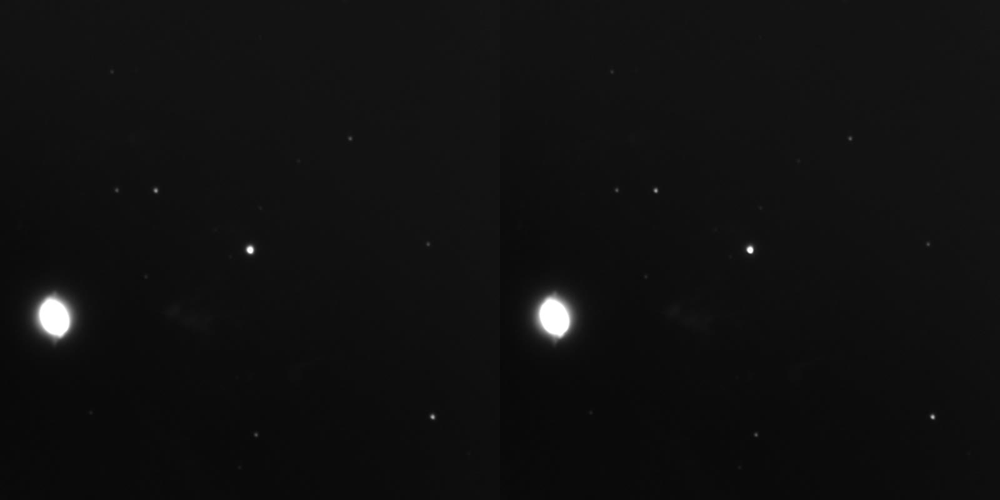
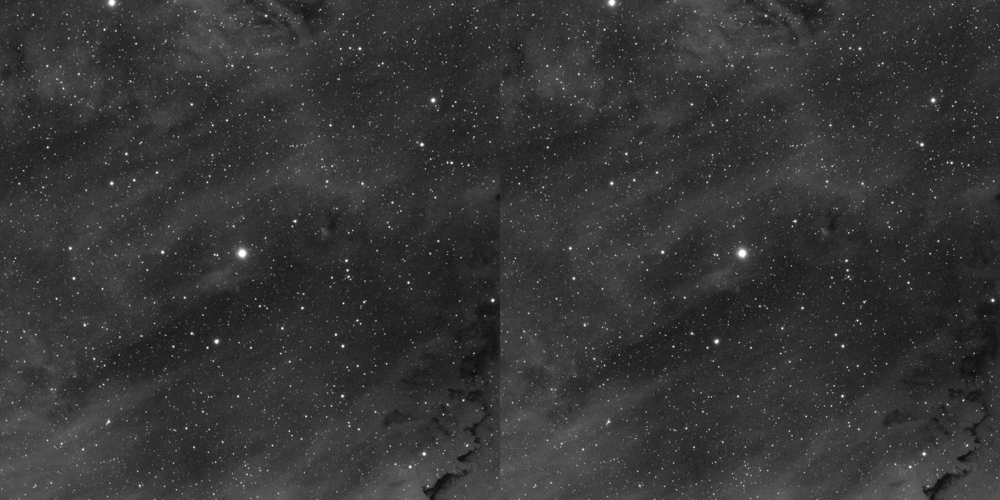
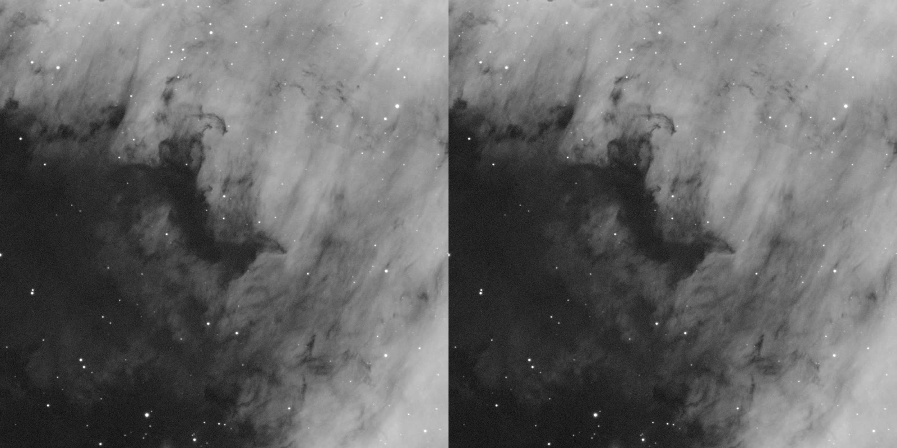
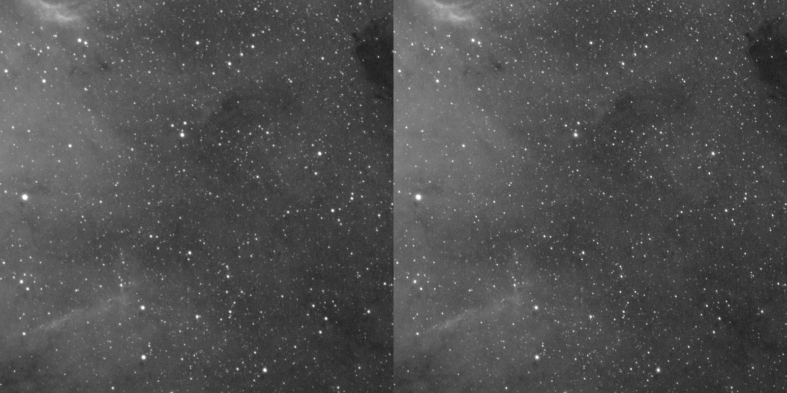

# Conservative deconvolution on the AstroBin telescope corpus

## Purpose

This is a small feasibility sample from `/Volumes/astrobin/_ByTelescope`, not a
benchmark claim. It checks whether the conservative classical prototype makes
a measurable, restrained change on real integrated images and establishes a
repeatable before/after-review convention for later model work.

Each result used damped Richardson-Lucy with four iterations, a 35% blend, a
`0.001` channel-range noise fraction, and a maximum multiplicative correction
of `2`. The Gaussian PSF FWHM was measured from round, unsaturated stars in the
input. All panels show a 1200 by 1200 pixel crop, resampled identically, with
the input-derived display stretch applied to both halves. **Left is before;
right is after.**

## Results

| Telescope | Object/filter | Source | Stars | Median FWHM before -> after | Background MAD sigma before -> after |
| --- | --- | --- | ---: | ---: | ---: |
| C925 | NGC 6543 / HA | integrated XISF, 5971x3789 | 18 / 20 | 7.358 -> 7.088 px (-3.7%) | 0.00026130 -> 0.00026126 |
| SpaceCat61 | Sh2 119 / HA | integrated XISF, 6121x3984 | 906 / 823 | 2.030 -> 1.719 px (-15.3%) | 0.00012518 -> 0.00012515 |
| Askar107PHQ | NGC 7000 / HA | integrated XISF, 6174x4060 | 635 / 696 | 3.293 -> 2.976 px (-9.6%) | 0.00026709 -> 0.00026697 |
| Radian61 | NGC 7000 / Hydrogen-alpha | integrated linear FITS, 6261x4202 | 1115 / 990 | 3.636 -> 3.290 px (-9.5%) | 0.00077916 -> 0.00078029 |

Star counts can change because the same selection criteria are run independently
on each result. The FWHM figures are robust second-moment estimates, not
photometric PSF fits, so they are directionally useful but should not be treated
as instrument characterization. Background values are in normalized linear
sample units.

The explicit asinh black/white points were `0.00430/0.02000` for C925,
`0.00100/0.00771` for SpaceCat61, `0.00090/0.00337` for Askar107PHQ, and
`0.05930/0.08143` for Radian61. Every panel used strength `10`.

### C925: NGC 6543, HA



The relatively wide measured PSF produces the smallest aggregate improvement
under the conservative damping. The bright compact target and nearby stars do
not show an obvious ringing halo at this display scale.

### SpaceCat61: Sh2 119, HA



This is the largest measured FWHM change. Fine stars tighten while the diffuse
nebular background remains visually stable, but the field is dense enough that
future evaluation should match and measure the same stars before and after.

### Askar107PHQ: NGC 7000, HA



The result is deliberately subtle: stellar cores and high-contrast dust edges
tighten without a separate local-contrast operation.

### Radian61: NGC 7000, Hydrogen-alpha



The output retains the input's broad background distribution. This source has
both `EXPOSURE=90` and `EXPTIME=901` in its inherited headers, so the corpus
record must not silently choose one as authoritative training metadata.

## Source provenance

The evaluated sources, relative to `/Volumes/astrobin/_ByTelescope`, were:

```text
C925/_Process/2026/NGC 6543/master/
  masterLight_BIN-1_6248x4176_EXPOSURE-300.00s_FILTER-HA_mono_autocrop.xisf
SpaceCat61/Sh2 119/process_08022025/master/
  masterLight_BIN-1_6248x4176_EXPOSURE-300.00s_FILTER-HA_mono_autocrop.xisf
Askar107PHQ/_Process/Stacked/North American - 20260131/master/
  masterLight_BIN-1_6248x4176_EXPOSURE-300.00s_FILTER-HA_mono_autocrop.xisf
Radian61/NGC7000/2025-07-18/Siril/
  Target-Hydrogen-alpha-session_1.fits
```

The XISF images were decoded as mono Float32 with `xisf` 0.9.7 and written by
Astropy 6.0.1 to temporary Float32 FITS files while copying object, filter,
instrument, telescope, exposure, pixel-size, focal-length, coordinate, and
available PSF/noise cards. Those temporary FITS files and full restored outputs
are not committed; only the derived review crops are present here.

## Reproduction

For each converted/source FITS, measure representative unsaturated-star FWHM,
then run:

```text
seiza deconvolve input.fits --output restored.fits \
  --psf-fwhm MEASURED_PIXELS --iterations 4 --amount 0.35 \
  --noise-fraction 0.001 --max-correction 2
```

Resolve black and white points from the *input* once, and use the same explicit
stretch for both images:

```text
seiza stretch input.fits --output before.png asinh \
  --black INPUT_BLACK --white INPUT_WHITE --strength 10
seiza stretch restored.fits --output after.png asinh \
  --black INPUT_BLACK --white INPUT_WHITE --strength 10
```

The evidence supports a lightweight experimental pass. It does not demonstrate
recovery of ground truth, validate every optical PSF, or justify training on
these outputs as targets. The [model-based restoration plan](../design/ml-restoration-training.md)
defines the stronger dataset and evaluation contract.
