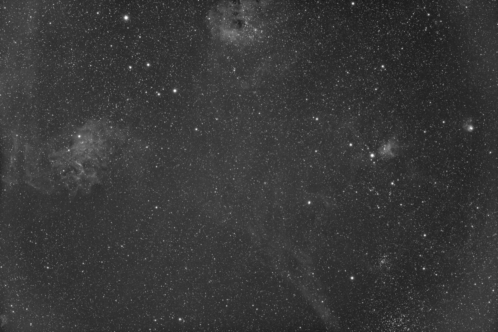

# Image and live stacking

Status: initial online engine and CLI vertical slice in progress

## Boundary

Stacking is a separate crate, `seiza-stacking`. It consumes decoded linear
frames and uses Seiza's star detector, but it does not depend on plate solving,
hosted catalogs, or the CLI. This lets PSF Guard filter a sequence first and
then push accepted frames directly into the same engine.

The output is registered to the first accepted frame. When that reference FITS
contains WCS metadata, the CLI carries the compatible WCS cards to the output;
registration itself remains local and offline.

## Pipeline

Each light frame follows this order:

1. decode physical FITS samples without a display stretch;
2. apply optional master bias, dark, and normalized flat calibration;
3. debayer a calibrated CFA frame, when present;
4. detect stars and fit a similarity transform to the reference frame;
5. resample onto the reference pixel grid with invalid border samples masked;
6. optionally normalize background location and dispersion globally or on a
   bilinearly interpolated tile grid;
7. evaluate live-stack admission gates without mutating the accumulator;
8. update the stack mean, variance, coverage, and rejection counts only when
   the complete frame is admitted.

Calibration masters are assumed to be integrated master frames. A dark is
assumed to include its bias pedestal; when both bias and dark are supplied,
dark scaling uses `light - bias - scale * (dark - bias)`. A flat has the bias
removed when available and is divided by its robust positive median before it
is applied. Planar RGB flats are normalized independently per channel; CFA
flats remain in their one-channel sensor sampling and are applied before
debayering. Without a master bias, the dark's inseparable bias pedestal is
subtracted unscaled even when exposure metadata differs. With a bias and a
known master-dark duration, missing light exposure is a typed rejection rather
than an unsafe 1:1 scaling assumption.

## Registration

Registration uses bright-star triangles whose side-length ratios are invariant
under translation, rotation, and uniform scale. Candidate correspondences
propose a non-reflecting similarity transform. The winning transform is the one
placing the most source stars near reference stars, then it is refined by a
least-squares similarity fit over its inliers. Diagnostics retain matched-star
count, RMS residual, translation, rotation, and scale.

The first slice deliberately rejects strong shear and reflection. Optical
distortion and mosaic reprojection need a higher-order or WCS mapping and must
be explicit future modes rather than silently entering a live stack.

## Normalization

Global normalization maps the source frame's robust median and MAD-derived
dispersion to the reference. Local normalization computes the same affine
mapping on a tile grid and interpolates gain and offset per pixel. Local mode
is optional because it can suppress real large-scale gradients or nebulosity
when the tile size is chosen too small.

Admission evaluates the full, unclamped gain range. In local mode this prevents
one pathological tile from hiding behind a reasonable mean gain. Estimation
failures are typed frame rejections and do not abort the rest of a sequence.

## Rejection and live semantics

The online accumulator uses Welford mean and variance per output sample. After
a configurable warm-up, delta-sigma rejection tests each incoming normalized
sample against the current mean and standard deviation. Rejected samples do
not update the estimator and are counted in a rejection map.

An additive live stack also makes an irreversible frame-level decision. Before
integration, `FrameAcceptanceCriteria` checks image compatibility,
registration RMS, scale and rotation drift, usable overlap, normalization
gain, and the fraction of samples which would survive rejection. A failed gate
returns a typed `FrameDisposition::Rejected` and leaves every moment buffer
unchanged. The caller can therefore log or show the decision without having to
reconstruct the prior stack.

These are safety invariants, not an astrophotographic quality score. Seiza
Stacking does not rank frames by FWHM, eccentricity, background, transparency,
or sequence-relative quality. Those explicit scoring functions remain in PSF
Guard, which should normally offer only eligible frames to this API. Keeping
the boundary at `LinearImage`/`FitsFrame` plus a typed disposition lets a later
change move or share a scoring policy without coupling this crate to PSF Guard
today.

“Additive” describes how state evolves, not the pixel estimator exposed to the
caller. The implementation retains count, mean, and the second central moment,
which can produce a sum or mean and supports later additions without retaining
all source frames. It must also retain an ordered admission ledger at the host
boundary: reference identity, source identity, calibration/configuration
fingerprints, measured gates, and accepted/rejected disposition.
The CLI materializes this ledger with `--report`; its JSON contains SHA-256
input identities, calibration inputs, the complete configuration, and ordered
diagnostics. FITS and report outputs are written to adjacent temporary files
and atomically renamed only after the complete payload has been flushed.

This is appropriate for live feedback and bounded-memory pre-stacks, but it is
order-dependent and cannot revisit warm-up samples. A future exact batch mode
will make two passes: first estimate registered per-pixel location/dispersion,
then reread frames and accumulate only accepted samples. It can share cached
registration and normalization parameters with the online engine.

## Memory and integration

Live state is proportional to output pixels, not frame count: two `f32`
moments plus coverage and rejection counters per sample, alongside one decoded
input frame. Large RGB sensors still require substantial memory; tiled or
memory-mapped accumulators are follow-on backends behind the same API.
`LiveStacker::view` borrows the current mean and masks for a zero-copy live
renderer. `snapshot` copies owned maps when they are needed, while
`into_snapshot` consumes the accumulator for copy-free batch finalization.

PSF Guard owns sequence scoring, selection, and provenance. Its pre-stack
adapter will apply its existing sequence-quality policy and then offer eligible
source paths to `LiveStacker`; the stacker still applies only geometric and
numeric safety gates. PSF Guard will store both layers of decisions, the stack
configuration, accepted/skipped frame diagnostics, and source fingerprints
beside the derived artifact. A stack must not erase the per-exposure evidence
used to decide which frames entered it.

## Release-mode validation examples

These display-stretched JPEGs are derived only after the linear FITS stack is
complete. They are checked-in review artifacts, not inputs to the stacking
math.

The 6248x4176 Sadr sequence admitted all eight 300-second H-alpha frames.
Registration RMS ranged from 0.241 to 0.517 pixels. The end-to-end run,
including the full FITS, preview, SHA-256 report, and atomic publication, took
4.31 seconds and peaked at 948 MB resident memory.

The 9576x6388 Sh2-230 sequence offered 31 red 60-second frames to local
normalization. Eleven were admitted with 0.224 to 0.715 pixel RMS; twenty weak
registrations were rejected without changing the accumulator. The end-to-end
run took 16.61 seconds and peaked at 2.24 GB resident memory.

## Follow-on work

1. Exact two-pass sigma/MAD/Winsorized rejection for final batch integration.
2. Watched-directory CLI mode with atomic snapshots and restartable state.
3. Disk-backed/memory-mapped moment buffers for very large mono and RGB data.
4. Drizzle, distortion-aware WCS reprojection, weighting, and mosaic framing.
5. Raw calibration-frame integration and defect/cosmetic-correction maps.
