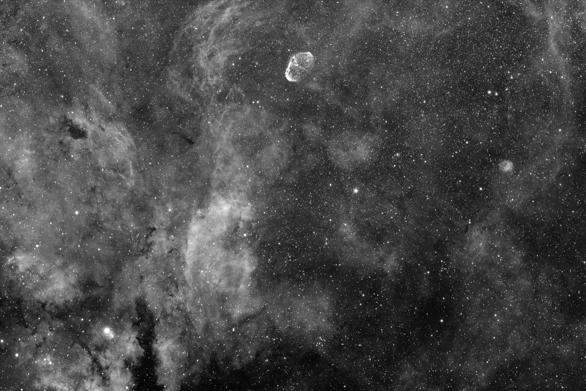
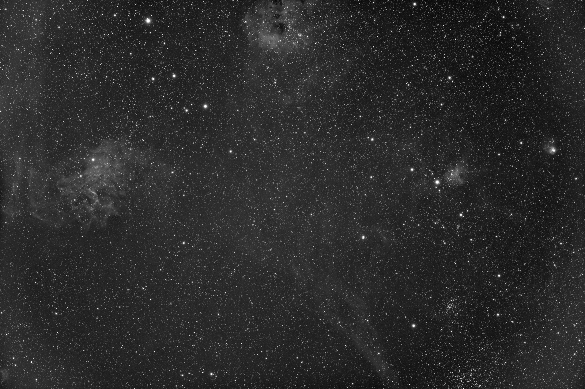

# Image and live stacking

Status: online engine, native bindings, resumable contexts, and two-pass
registered-frame integration implemented

## Boundary

Stacking is a separate crate, `seiza-stacking`. It consumes decoded linear
frames and uses Seiza's star detector, but it does not depend on plate solving,
hosted catalogs, or the CLI. This lets PSF Guard filter a sequence first and
then push accepted frames directly into the same engine.

The output is registered to the first accepted frame. When that reference FITS
contains WCS metadata, the CLI carries the compatible WCS cards to the output;
registration itself remains local and offline.

## Pipeline

Each light frame follows this order:

1. decode physical FITS samples without a display stretch;
2. apply optional master bias, dark, and normalized flat calibration;
3. debayer a calibrated CFA frame, when present;
4. detect stars and fit a similarity transform to the reference frame;
5. resample onto the reference pixel grid with invalid border samples masked;
6. optionally normalize background location and dispersion globally or on a
   bilinearly interpolated tile grid;
7. evaluate live-stack admission gates without mutating the accumulator;
8. update the stack mean, variance, coverage, and rejection counts only when
   the complete frame is admitted.

`LinearImage` carries either one channel or interleaved RGB. A native
three-plane FITS is converted from FITS planar storage to that interleaved
representation on input. A one-channel CFA FITS is calibrated before step 3,
then debayered to RGB. Registration star detection derives a temporary
luminance image, but the fitted transform is resampled across every channel;
normalization coefficients and accumulator samples remain channel-specific.
The writer converts interleaved RGB back to a standard three-plane linear
`float32` FITS, so using luminance for registration never discards output color.

Calibration inputs are integrated master frames. For legacy masters without
Seiza metadata, a dark is assumed to include its bias pedestal; when both bias
and dark are supplied, dark scaling uses
`light - bias - scale * (dark - bias)`. A flat has the bias removed when
available and is divided by its robust positive median before it is applied.
Planar RGB flats are normalized independently per channel; CFA flats remain in
their one-channel sensor sampling and are applied before debayering. Without a
master bias, the dark's inseparable bias pedestal is subtracted unscaled even
when exposure metadata differs. With a bias and a known master-dark duration,
missing light exposure is a typed rejection rather than an unsafe 1:1 scaling
assumption.

Masters produced by Seiza carry `SEIZAMST`, `SEIZAVR`, `NCOMBINE`, `BIASSUB`,
`DARKSUB`, and `FLATNORM` FITS cards. A bias-calibrated master dark is therefore
recognized as pure dark signal and is not bias-subtracted again. A calibrated,
normalized master flat likewise skips master-level calibration while the light
itself still receives its configured bias and dark correction. Master dark and
flat loaders also retain `BAYERPAT`, `XBAYROFF`, and `YBAYROFF`; when present,
that sampling must match the raw light rather than relying on dimensions alone.

## Host-owned compute pools

`push_fits_pipelined_with_pool` separates a non-Rayon coordinator and bounded
scoped reader workers from a supplied Rayon compute pool. Read/decode remains
outside the pool; all preparation after decode and ordered integration use
`ThreadPool::install`. A result channel per worker has capacity one, so each
worker holds at most one queued prepared frame plus the frame it is building.
The coordinator can hold one additional integrating frame. Reading the channels
round-robin preserves input order, admission decisions and accumulator bits.

Callbacks run only on the coordinator and need not be `Send`. Cancellation
drops receivers and joins workers, without interrupting reads already started.
Worker and callback panics unwind rather than leaving a blocked result channel.
A caller already on a Rayon worker takes a sequential fallback; it never waits
on a channel whose producer needs that occupied pool. The legacy pipelined API
keeps its original fallback and explicit-worker override behavior.

The explicit-pool pipelined API caps even requested worker counts by its frame budget,
reserving `(64 * pixels + 16 * samples)` bytes per worker and `4 * samples` for
the currently integrating reference-sized frame. This conservatively includes
decoded/calibrated/CFA/RGB buffers, detector scratch, and a queued frame. The
minimum one-worker budget is checked before reading. Larger-than-reference
sources, codec buffers, allocator overhead and unusual registration settings
are outside the estimate; a mandatory all-frame header scan would add latency
to remote storage. Hosts reserve their own reference, accumulator and every
resident session master separately. `PoolPipelineMemory::for_reference` exports
the same worker/integration estimate for host budget policy, without duplicating
the formula downstream. `CalibrationMasters::image_buffer_bytes`
counts sample lengths without claiming total process memory; deep clones must
also be counted.

`push_fits_sequential_with_pool` is the explicit no-queue alternative. It
shares the sequential engine used by the Rayon fallback, but reports
`SequentialRequested` and accepts only the normalized full-scale conversion,
pool and callback alongside the paths. Each callback completes before the next
read starts; neither decoding nor preparation overlaps another frame. The host
owns memory policy, with no pretend queue allowance needed to call this API.
`PoolPipelineMemory::sequential_bytes` estimates `64 * pixels + 8 * samples`
of scratch, excluding the reference, accumulator and masters. The smaller
sample allowance covers the source plus either conversion or registration,
without a queued or concurrently integrating frame. Both serial execution
modes report this estimate. The live reference and four accumulator arrays
add 20 bytes per sample; masters and the documented estimate exclusions remain
separate. The pipelined API still validates its queue budget before taking an
automatic Rayon fallback.

The returned report exposes execution mode, resolved workers and estimated
in-flight bytes. Timings sum read/decode, preparation and ordered integration,
and measure coordinator channel waits and whole-batch elapsed time. Preparation
and integration are timed inside the supplied pool, excluding admission to the
pool. Worker sums include discarded frames and may exceed wall time, so they
must not be presented as CPU utilization.

## Master construction

`build_master_from_fits` and `seiza master bias|dark|flat` construct the
masters consumed above. Bias and dark integration makes two passes over the
source paths:

1. calibrate each input as appropriate and estimate a per-sample mean and
   second central moment;
2. reread each input and compute the final mean after leave-one-out low/high
   sigma rejection.

Both bias/dark passes read every accepted input. Flat integration instead
calibrates and normalizes each input once, spools those f32 samples to temporary
storage, and combines bounded tiles with temporal median/MAD sigma rejection.
This avoids the inflated mean/variance that can retain overlapping stars in
sky flats. It preserves the raw sensor grid and CFA sampling; no star alignment
or spatial smoothing is applied. Two-input sets of any kind are averaged
without rejection. Temporal clipping still needs enough clean samples and
star motion; it cannot separate stationary stars or majority contamination
from the sensor response. Small or noisy sets can retain faint halos, and
contaminated majorities (including saturated cores) can be reinforced rather
than removed. Robust temporal clipping improves rejection but does not
guarantee star-free flats.

The flat tile, input read buffer, and per-pixel statistics workspace share a
64 MiB budget. Scratch space is four bytes per input sample, separate from the
output image, calibration masters, and per-input metadata. The default API
uses OS temp; `build_master_from_fits_with_scratch` accepts an existing host
cache directory. Scratch is removed on success, failure, or cancellation.

`MasterBuildOptions::cancel` takes a `CancelSignal`, checked between input
frames and during flat scratch I/O/tile processing, and returns
`Error::Cancelled` without writing a master.
An interactive caller that builds masters inside a user-visible job needs that
way out; batch callers leave it `None`.

For bias and dark masters, leave-one-out statistics let a single cosmic-ray
outlier be rejected even in
a small calibration set. Rereading keeps memory proportional to a handful of
image-sized buffers rather than the number of source frames. It intentionally
trades additional sequential I/O for bounded memory; master generation is an
occasional batch operation rather than a live capture path.

A bias master integrates raw bias exposures. A dark master optionally removes
a supplied master bias from every raw dark before integration and records the
resulting state. A flat master optionally applies bias plus dark-flat
calibration, normalizes every calibrated exposure per channel, then integrates
the normalized responses. A bias-subtracted dark-flat requires the bias master
as well, because dark current alone cannot remove the flat's bias pedestal.
An uncalibrated normalized flat remains usable but cannot be safely
bias-corrected after normalization, so the CLI warns when neither calibration
input is provided. A dark-flat which still contains its bias pedestal must
match the flat exposure unless a master bias makes its dark signal scalable.

Before samples are mixed, the builder requires identical dimensions, channel
count, and CFA layout. When headers provide them, it also checks camera,
binning, pixel size, gain, offset, readout mode, temperature, and filter; dark
exposures must agree or be explicitly asserted. The CLI's optional JSON report
adds SHA-256 identities, configuration, calibration inputs, and accepted and
rejected sample counts for every source frame. Both FITS and JSON outputs are
published atomically. Actual rejection is recorded in FITS `REJMETH` and the
JSON configuration, including `NONE` when only two inputs survived admission.
The JSON `rereads_inputs` describes integration pixel reads, excluding the
separate provenance hash pass. If all samples are rejected, flats fall back
to their temporal median while bias/dark masters retain the unclipped mean.
Accepted input statistics retain the corresponding source identity even when
an earlier frame is skipped; skipped identities and admission reasons are
reported separately rather than paired with an accepted frame's counts.

## Registration

Registration first votes for bounded translations across every retained star.
This low-drift seed is deliberately independent of brightness rank, so noisy,
dithered, or cropped frames can register when their common stars fall outside
one frame's brightest subset. Bright-star triangles complement the seed for
rotation and scale; their side-length ratios are invariant under translation,
rotation, and uniform scale. Candidate correspondences propose a non-reflecting
similarity transform. The winning transform is the one placing the most source
stars near reference stars, then it is refined by a least-squares similarity
fit over its inliers. Detection input receives only a positive affine scaling
to `[0, 1]`; it is not percentile-clipped, because clipping bright samples can
merge components and destroy the flux ordering used to retain stars.

The effective drift limit is the larger of
`RegistrationOptions::maximum_drift_pixels` and the reference frame's larger
dimension multiplied by `maximum_drift_fraction`. Defaults are 256 pixels and
15%, respectively. This limit bounds both the translation search and the
displacement of the fitted transform at the reference-frame center. The CLI
exposes the two components as `--max-registration-drift` and
`--max-registration-drift-fraction`, and records both plus the effective pixel
limit in its report. Source frames may have different pixel dimensions:
resampling maps their valid samples onto the fixed reference grid, masks pixels
outside the source crop, and leaves the existing minimum-overlap admission gate
to decide whether enough of the frame can be integrated. Diagnostics retain
matched-star count, RMS residual, center drift, translation, rotation, scale,
and usable overlap.

A German-equatorial-mount meridian flip is a valid second camera orientation,
not 180 degrees of unexpected rotation. By default, the rotation admission gate
therefore measures angular deviation from the nearer of 0 or 180 degrees. A
179.3-degree fit is admitted as a 0.7-degree deviation under the default
10-degree limit, while diagnostics retain the full 179.3-degree transform. The
resampler applies that complete transform to turn the incoming pixels back onto
the immutable reference grid before normalization or integration. An
epsilon-bounded coordinate clamp prevents exact half-turn trigonometric
roundoff from masking otherwise valid edge samples.

`PIERSIDE` is useful acquisition provenance and may be used by a host as a
registration hint, but [ASCOM defines it as mount pointing
state](https://ascom-standards.org/newdocs/ptgstate-faq.html), not a pixel
mapping. It cannot replace the measured transform because it supplies no
residual angle, translation, scale, crop offset, or registration confidence.
When a complete celestial [FITS
WCS](https://fits.gsfc.nasa.gov/fits_wcs.html) is present, its linear matrix
describes pixel orientation; otherwise the matched-star transform remains the
stacking source of truth.

The first slice deliberately rejects strong shear and reflection. Optical
distortion and mosaic reprojection need a higher-order or WCS mapping and must
be explicit future modes rather than silently entering a live stack.

## Normalization

Global normalization maps the source frame's robust median and MAD-derived
dispersion to the reference. Local normalization computes the same affine
mapping on a tile grid and interpolates gain and offset per pixel. Local mode
is optional because it can suppress real large-scale gradients or nebulosity
when the tile size is chosen too small.

Admission evaluates the full, unclamped gain range. In local mode this prevents
one pathological tile from hiding behind a reasonable mean gain. Estimation
failures are typed frame rejections and do not abort the rest of a sequence.

## Rejection and live semantics

The online accumulator uses Welford mean and variance per output sample. After
a configurable warm-up, delta-sigma rejection tests each incoming normalized
sample against the current mean and standard deviation. Rejected samples do
not update the estimator and are counted in a rejection map.

An additive live stack also makes an irreversible frame-level decision. Before
integration, `FrameAcceptanceCriteria` checks image compatibility,
registration RMS, scale and rotation drift, usable overlap, normalization
gain, and the fraction of samples which would survive rejection. A failed gate
returns a typed `FrameDisposition::Rejected` and leaves every moment buffer
unchanged. The caller can therefore log or show the decision without having to
reconstruct the prior stack.

These are safety invariants, not an astrophotographic quality score. Seiza
Stacking does not rank frames by FWHM, eccentricity, background, transparency,
or sequence-relative quality. Those explicit scoring functions remain in PSF
Guard, which should normally offer only eligible frames to this API. Keeping
the boundary at `LinearImage`/`FitsFrame` plus a typed disposition lets a later
change move or share a scoring policy without coupling this crate to PSF Guard
today.

“Additive” describes how state evolves, not the pixel estimator exposed to the
caller. The implementation retains count, mean, and the second central moment,
which can produce a sum or mean and supports later additions without retaining
all source frames. It must also retain an ordered admission ledger at the host
boundary: reference identity, source identity, calibration/configuration
fingerprints, measured gates, and accepted/rejected disposition.
The CLI materializes this ledger with `--report`; its JSON contains SHA-256
input identities, calibration inputs, the complete configuration, and ordered
diagnostics. FITS and report outputs are written to adjacent temporary files
and atomically renamed only after the complete payload has been flushed.
The generic mono/RGB float serialization and atomic FITS publication live in
`seiza-fits`; `seiza-stacking` supplies only the stack and calibration-master
header semantics.

This is appropriate for live feedback and bounded-memory pre-stacks, but it is
order-dependent and cannot revisit warm-up samples. An early satellite or
aircraft trail raises both the running mean and variance and can stay in the
image even when an identical late trail would be rejected. Lowering the online
sigma threshold cannot remove a sample already integrated.

`integrate_registered_frames` supplies the completed-stack path. It reads each
admitted frame twice through a caller-supplied loader: first to estimate
per-sample moments, then to compute a mean and variance after leave-one-out
sigma rejection. Removing the candidate sample from its comparison statistics
allows a sufficiently strong isolated transient to be rejected even at
three-frame depth, including the registration reference and other online
warm-up frames. Multiple
similar transients overlapping one pixel can still inflate the comparison
variance and mask one another, especially in shallow stacks; this estimator is
not a robust median/MAD estimator and cannot promise to remove every trail.

Low-depth noise estimates are themselves uncertain. A three-sigma rule applied
directly to two other observations rejects about a quarter of ordinary Gaussian
noise samples. The batch estimator therefore converts each nominal Gaussian
tail probability to a Student-t predictive threshold, with `N - 2` degrees of
freedom and scale `sqrt(1 + 1 / (N - 1))`. This is the single-future-observation
case of the [NIST prediction-limit formula](https://www.itl.nist.gov/div898/software/dataplot/refman1/auxillar/predlimi.htm),
using the other `N - 1` samples as the comparison set. The
[statrs distribution implementation](https://docs.rs/statrs/latest/statrs/distribution/struct.StudentsT.html)
supplies the normal survival function and Student-t quantile; thresholds are
computed once per coverage count, not per pixel. Three-sigma defaults retain
approximately the nominal 99.73% of independent Gaussian noise at depths 3,
5, 20, and 100 without introducing masked holes. Shallow stacks consequently
need stronger evidence of a trail than deep ones.

The caller reuses the original calibration, preparation, registration, and
normalization mapping. The API checks identical shapes and per-frame sample
digests across passes and fails if any replayed input changes. It does not
repeat frame admission or silently drop unreadable inputs. Frames have equal
weight after normalization, matching the online stack. Non-finite border
samples do not contribute to moments or rejection counts; fewer than three
finite samples at a pixel are averaged without clipping. The noise floor is
explicit in the registered image's physical units. Returned per-frame counts
describe the completed estimator rather than earlier online decisions.

Batch moments use `f64` for the leave-one-out subtraction. Total working state
is approximately 36 bytes per output sample plus the current loaded image and
small per-frame digests and diagnostics. Loading runs in index order in each
pass and receives a pass enum for progress reporting; optional cancellation
is checked before and after each load. A caller can checkpoint and release its
online state before this stage. Resumable live contexts are unchanged and do
not pretend that a completed, clipped mean is an additive accumulator.

## Memory and integration

Live state is proportional to output pixels, not frame count: two `f32`
moments plus coverage and rejection counters per sample, alongside one decoded
input frame. Large RGB sensors still require substantial memory; tiled or
memory-mapped accumulators are follow-on backends behind the same API.
`LiveStacker::view` borrows the current mean and masks for a zero-copy live
renderer. `snapshot` copies owned maps when they are needed, while
`into_snapshot` consumes the accumulator for copy-free batch finalization.

`save_context` is the durable counterpart to those in-memory views. It streams
a versioned metadata envelope and the original prepared reference, calibration
buffers, Welford mean and second moment, coverage/rejection maps, counters,
headers, and source ledger through a checksummed Zstandard frame into an
adjacent temporary file. Only a complete, flushed context is atomically renamed
over the destination. `open_context` validates the container and accumulator,
rebuilds the registrar from the original reference, and returns a mutable
`LiveStacker`; it does not approximate resumption by weighting the finished
mean as one new observation.

The C ABI preserves those same performance boundaries. `SeizaLiveStacker`
accepts either copied, pre-calibrated interleaved float arrays or FITS paths
with optional master calibration files. Frame disposition is returned as owned
JSON so admission diagnostics can grow without changing the ABI. Live mean,
coverage, and rejection pointers borrow accumulator storage; an immutable
`SeizaStackSnapshot` additionally owns variance and can write a linear FITS.
Snapshotting a running stack copies full-frame state, while finalization takes
a pointer-to-handle, nulls it, and moves the state into the snapshot. This makes
ownership loss explicit to Swift/.NET/C callers and retains the Rust
`view`/`snapshot`/`into_snapshot` distinction.
The ABI additionally exposes `seiza_live_stacker_save_context` and
`seiza_live_stacker_open_context`, so Swift and .NET applications need retain
only a context path between process lifetimes. Python exposes the same contract
as `LiveStacker.save_context` and `LiveStacker.open_context`.

Calibration master construction is also bounded by image size rather than
input count. Its two-pass estimator retains per-sample moments and output
counts plus one decoded source frame, then rereads the sequence for clipped
integration. It is deliberately separate from the order-dependent live-stack
estimator.

PSF Guard owns sequence scoring, selection, and provenance. Its pre-stack
adapter will apply its existing sequence-quality policy and then offer eligible
source paths to `LiveStacker`; the stacker still applies only geometric and
numeric safety gates. PSF Guard will store both layers of decisions, the stack
configuration, accepted/skipped frame diagnostics, and source fingerprints
beside the derived artifact. A stack must not erase the per-exposure evidence
used to decide which frames entered it.

## Performance model

Frames remain ordered because the online delta-sigma estimator is intentionally
history-dependent. Work within one frame is data-parallel instead: calibration,
star-detector normalization and thresholding, resampling, local-normalization
tiles and interpolation, admission classification, and accumulator updates are
split across independent rows, tiles, or samples. `RAYON_NUM_THREADS` may cap
the shared worker pool when an embedding application needs to reserve CPU.

The real-data performance regression is the 31-frame, 9576x6388 Sh2-230 red
sequence below. With its 3.8 GB of inputs copied to local storage, release-mode
local normalization and delta-sigma rejection scale as follows on an 18-core
Apple Silicon host using Rust 1.97.1. Timings include FITS decode and the 233 MB
linear FITS output, but omit the optional preview and provenance report.

| Worker threads | Wall time |
| ---: | ---: |
| 1 | 25.73 s |
| 4 | 9.58 s |
| 8 | 6.83 s |
| 18 | 5.57 s |

The same 18-thread workload took 39.59 seconds before the full-frame loops and
local tile estimates were parallelized. The pre- and post-optimization FITS
files are byte-for-byte identical. CI does not impose a noisy wall-clock gate;
this checked-in workload and output-equivalence check are the performance
regression procedure. Scaling beyond eight workers is useful but diminishing,
so full-frame star detection and memory bandwidth are now the practical gate.

## Release-mode validation examples

These display-stretched JPEGs are derived only after the linear FITS stack is
complete. They are checked-in review artifacts, not inputs to the stacking
math.

The 6248x4176 Sadr sequence admitted all eight 300-second H-alpha frames.
Registration RMS ranged from 0.241 to 0.517 pixels. The end-to-end run,
including the full FITS, preview, SHA-256 report, and atomic publication, took
4.31 seconds and peaked at 948 MB resident memory.

The 9576x6388 Sh2-230 sequence offered 31 red 60-second frames to local
normalization. All 31 were admitted with 0.052 to 0.132 pixel RMS and measured
center drift from 0.3 to 25.7 pixels. The original end-to-end run took 47.97
seconds, including the full FITS, preview, SHA-256 report, and atomic
publication from the original source volume before the performance work above.
An earlier percentile-clipped detector admitted only eleven; this sequence is
retained as a regression case for preserving star rank under drift.

The same field from only the eleven frames that earlier detector admitted.
Integrating a third of the sequence leaves a grainier background than the
31-frame stack above, which is the outcome this regression case guards.

## Follow-on work

1. Exact two-pass sigma/MAD/Winsorized rejection for final batch integration.
2. Watched-directory CLI mode with atomic snapshots and restartable state.
3. Disk-backed/memory-mapped moment buffers for very large mono and RGB data.
4. Drizzle, distortion-aware WCS reprojection, weighting, and mosaic framing.
5. Raw calibration-frame integration and defect/cosmetic-correction maps.
