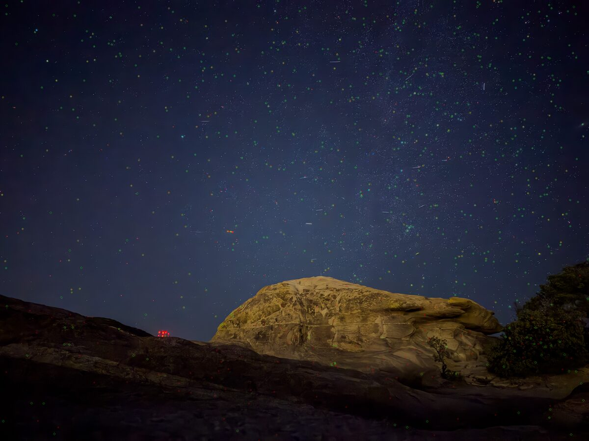
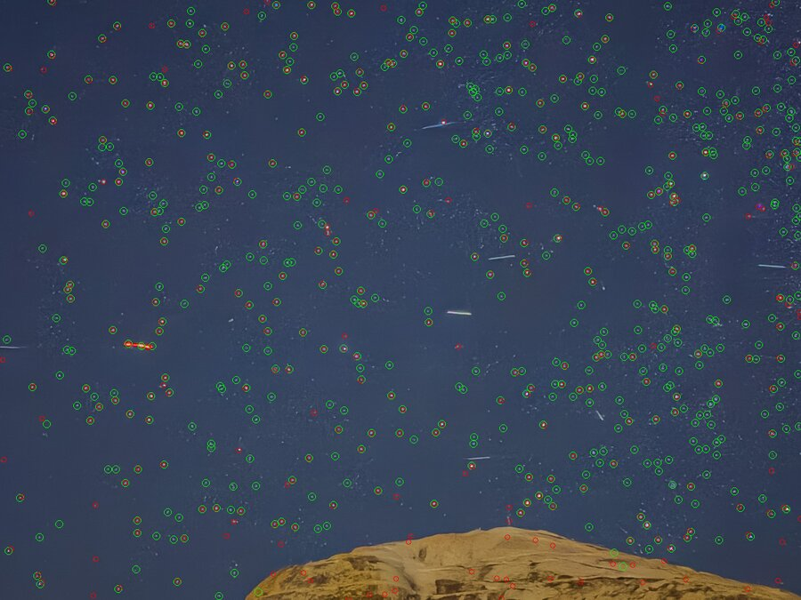
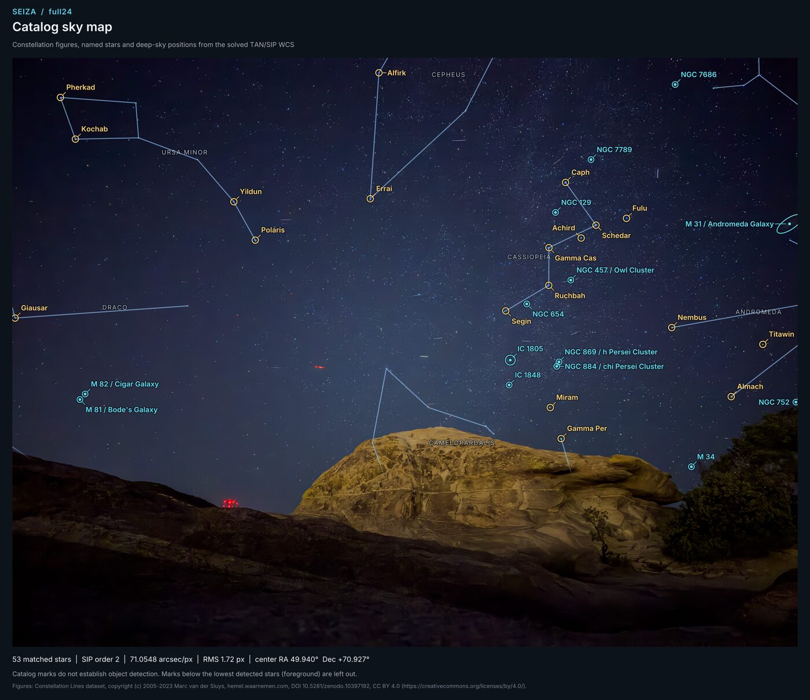

# seiza-cli

The `seiza` command-line tool: star detection, hinted and blind plate
solving, and star/object dataset management for astrophotography. The
library lives in the [seiza](https://crates.io/crates/seiza) crate.

## Install

### Windows

Download the x86-64 MSI from the
[latest GitHub release](https://github.com/theatrus/seiza/releases/latest).
The installer supports all-users and current-user installs, adds `seiza` to
`PATH` by default, and can launch the guided catalog setup when installation
finishes. All-users installs place catalogs in the shared
`%ProgramData%\Seiza\catalogs` directory; current-user installs use the
user's local application-data directory.

A portable x86-64 ZIP is available on the same release page. See the
[Windows installer documentation](https://github.com/theatrus/seiza/blob/main/packaging/windows/README.md)
for feature selection, unattended installation, and catalog-directory details.

### Cargo

```
cargo install seiza-cli
```

## Solving

```
# Hinted: approximate center (or FITS RA/DEC headers) plus pixel scale.
# --data takes a catalog file or a directory of catalogs; after
# `seiza setup` it can be omitted entirely.
seiza solve image.jpg --data data --ra 324.8 --dec 57.5 --scale 2.8
seiza solve light.fits --scale 1.45

# Blind: no position, just a plausible scale range. A directory supplies
# the deepest catalog and the blind index automatically.
seiza solve-blind image.jpg --data data --min-scale 0.5 --max-scale 15

# JPEG: inspect EXIF and solve a wide field without a pointing hint.
seiza image-info phone.jpg
seiza solve-blind phone.jpg --data data --sip-order 2 \
  --annotate solved.png --wcs solved.wcs

# A labelled chart: constellation figures, named stars, deep-sky objects,
# with marks on the ground below the horizon left out
seiza solve-blind phone.jpg --data data --sip-order 2 --sky-map sky-map.png \
  --sky-map-foreground

# Annotate detections or list objects in a solved field
seiza detect image.jpg --annotate out.png
seiza solve image.jpg --data data ... --objects data

# Predict tracks for one exposure from a cached current OMM set, or from an
# offline/historical OMM JSON or TLE file. FITS supplies time and OBSGEO when
# present; explicit metadata is also accepted.
seiza solve light.fits --scale 1.45 --satellites-celestrak --annotate tracks.png
seiza solve light.fits --scale 1.45 --satellites elements.json \
  --time 2026-07-18T08:30:00Z --exposure-seconds 30 \
  --observer-lat 37.3 --observer-lon -122.0 --observer-alt-m 50

# Query objects when sky bounds are already known; no image or solve needed
seiza catalog objects --data data --ra 10.6848 --dec 41.2691 --radius 3
seiza catalog objects --data data \
  --corner 8.91,42.14 --corner 12.47,42.02 \
  --corner 12.31,40.35 --corner 9.02,40.46 \
  --sort prominence --format json

# Resolve exact IDs/names or complete names; no image, solve, or network needed
seiza catalog object --data data "M 31"
seiza catalog object --data data "openngc:NGC224"
seiza catalog object --data data "andro" --prefix --limit 10
seiza catalog star --data data "TYC 5949-2777-1" --format json
seiza catalog star --data data "HIP 32349"
seiza catalog star --data data "RR Lyr"
seiza catalog star --data data "STF 2382 AB"
seiza catalog star --data data "RR L" --prefix --limit 10

# Distance to an object, from the optional object-distances.bin
seiza catalog distance --data data "M 42"
seiza catalog distance --data data "Horsehead Nebula" --format json
```

Explicit file paths still work everywhere a directory is shown, for
custom-built catalogs or unusual layouts.

### JPEG metadata and pixel coordinates

Raster inputs are decoded and EXIF Orientation is applied once, including
mirrors and the four transforms that swap width and height. Every command
that reads a JPEG, PNG or TIFF does this, including the ASTAP and
`solve-field` drop-ins and the JSON-RPC worker, and so do the C API and the
desktop apps built on it: detection, solving, annotations, previews and
exported WCS all use the same upright pixels.
WCS pixel coordinates in the library are zero-based; the FITS WCS export
uses FITS' one-based CRPIX convention. Apply the source Orientation before
overlaying an exported WCS on the original JPEG. Annotated PNGs contain
already-oriented pixels and must not be rotated a second time.

`image-info` emits JSON containing original/oriented dimensions, the applied
transform and optional EXIF fields: camera, acquisition timestamp,
subseconds, timezone offset, GPS position/altitude, heading and focal length.
It recognizes the file type from its content, not its name, and declines
FITS and XISF, whose headers carry this instead. Subseconds retain leading
zeros. The UTC acquisition time comes from DateTimeOriginal with
OffsetTimeOriginal, or else from the GPS date and time stamps, which are UTC
by definition (`capture_time_source` says which); the machine's timezone is
never assumed. An explicit `solve --time`
overrides the EXIF acquisition hint used for minor bodies. Missing/malformed
EXIF fields remain optional and do not prevent a stellar solve.

When `solve-blind` scale bounds are omitted and a valid 35mm-equivalent focal
length is present, the CLI estimates central angular scale from the decoded
image diagonal and first searches between half and twice that estimate. The
estimate assumes the image is the camera's whole frame, so a crop or a phone
held to an eyepiece can fall outside it; when that first search finds
nothing, `solve-blind` searches again from 0.1"/px up to the estimate's
coarse end. Each explicit `--min-scale` / `--max-scale` holds in both
searches, and a hint bound that conflicts with an explicit one is dropped.
Without this metadata the previous 0.1–20 arcsec/px defaults apply. SIP
remains opt-in; compare residuals with and without it.

An iPhone main-camera frame (24 mm equivalent, from
[#210](https://github.com/theatrus/seiza/pull/210)) solved blind at
71″/px, with detections in green and Gaia stars in red:



The same frame cropped to its central 1344×1008 pixels makes the
focal-length estimate three times too coarse; the first search misses and
the wide retry solves it at 72″/px:

```
pixel-scale search: 110.669–442.677"/px (EXIF equivalent focal length; explicit bounds override)
600 stars detected in 1344x1008 image
no solution in the EXIF focal-length range; retrying 0.100–442.677"/px
Blind-solved in 2.02s:
  center     : 03h 19m 42.05s +70° 56′ 13.5″  (49.92521°, 70.93708°)
  pixel scale: 72.0169"/px
  quality    : 106 stars matched, RMS 116.265"
```



`--annotate` on `solve` and `solve-blind` circles detected stars (green) and
catalog stars (red). Fields wider than 10° across the diagonal, such as phone
and camera-lens frames, get small markers and up to 600 catalog stars;
narrower telescope fields get larger markers and 300 stars. Annotated
images, like sky maps, are pictures to look at: FITS and XISF input is drawn
from an automatic display stretch, in colour when the file has colour,
whatever `--detection-backend` the solve used.

### Sky map

`--sky-map <out.png>` on `solve` and `solve-blind` writes a chart of the
solved image (EXIF-oriented, as loaded) for sharing. FITS and XISF images
get an automatic display stretch, in colour when the file has colour:

- constellation stick figures (light blue) and constellation names;
- stars with IAU proper names down to magnitude 4.5 (gold), plus figure
  stars of magnitude 3 or brighter without one, by Bayer designation
  ("Gamma Cas", "Eta Cen"); the brightest 28 get labels;
- the 14 most prominent deep-sky objects (cyan), with common names,
  catalog ellipses for large ones, and "(edge)" when only the extent
  reaches the frame;
- a title bar, and a footer with matched stars, SIP order, pixel scale, RMS,
  field centre and the line-data credit.

Labels go where they overlap nothing placed before them, brightest stars
first, and are dropped when nowhere fits. `--sky-map-width` sets the width,
from 640 to 12000 pixels (default 2100).

`--sky-map-foreground` is for a photo with a horizon, trees or buildings in
it: marks below the lowest detected stars that a catalog star confirms are
left out, and figure lines fade there. It looks only at fields over 10°
across, and only where the stars stop well short of the bottom of the frame
across several neighbouring columns, so a frame with stars everywhere loses
nothing. A named star the image shows is kept even below that line. The
footer says when marks were left out.

Star names come from the star-identifier sidecar and objects from
`objects.bin`, found next to `--data` or in the standard places (`solve
--objects` picks the object file); without them the map still has the
figures. Catalog marks show where things are, not that they were detected.



The figures are the Constellation Lines dataset by Marc van der Sluys
(2005-2023), hemel.waarnemen.com. DOI: 10.5281/zenodo.10397192. Licensed under
CC BY 4.0. Labels use the Inter typeface (SIL Open Font License 1.1, see
[`fonts/`](fonts/README.md)).

EXIF Orientation is distinct from camera pointing. GPSImgDirection and its
magnetic/true-north reference are reported but do not seed the solver; the
stellar WCS determines pointing and rotation. HEIF and RAW/DNG decoding and
multi-frame timing are not supported by this JPEG metadata path.

JPEG DateTimeOriginal and ExposureTime **do not establish a continuous
exposure**. In particular, phone Night Sight/Night mode can combine many
frames. Satellite overlays therefore still require explicit `--time` and
`--exposure-seconds` describing one actual exposure; never pass a stack's
total integration. JPEG GPS latitude/longitude can supply the observer
position when both explicit coordinates are absent. Explicit coordinates
take priority as a pair. EXIF GPS altitude is reported with its original
reference and is not treated as ellipsoid height: supply
`--observer-alt-m` when that height is known (otherwise the existing zero
height default applies).

Star detection defaults to `--detection-backend auto`: decoded 8-bit images
(including color JPEGs) and MTF-compressed FITS use the compact u8 pipeline,
while other higher-precision images use f32. Pass `--detection-backend f32` to
retain fractional luma during an 8-bit solve or to detect directly from linear,
native-precision FITS samples; pass `--detection-backend u8` to explicitly
quantize any input. The option is global and applies to `detect`, `solve`,
`solve-blind`, and local `worker` solves.

Auto solves default to `--detection-fallback f32`. After an Auto/u8 solve miss,
converted 8-bit color is redetected as f32 and FITS is reopened so detection can
use its linear high-precision samples. `--detection-fallback none` disables the
retry. Explicitly selected detection backends never fall back.

`catalog objects` accepts a cone or a convex polygon whose vertices are in
boundary order. It can filter by object kind, magnitude, angular size, and
common-name availability; results can be emitted as a table, JSON, or CSV.
JSON and CSV include primary and alternate stable IDs, primary and contributing
source provenance, aliases, and parent IDs when the catalog provides them. The
prominence score is a catalog-based prediction, not proof that the object is
visible in the image pixels.

`catalog object` resolves primary/common names, aliases, and stable or
alternate IDs. Both object viewport queries and name completion use indices
embedded in the memory-mapped `objects.bin`; normal open does not decode every
record or touch every index page. Add `--all-sources` to audit every normalized
upstream row, preferred facet selection, and source-qualified geometry.

`catalog distance` reads `object-distances.bin`, an optional download that
gives about 180,000 catalog objects a distance in parsecs: clusters, nebulae,
supernova remnants, dark clouds and galaxies. Each comes with its range where
the source gives one, the method, the source and its licence, and the
publication. An object no source measures may borrow a distance: from the
galaxy it lies in (a cluster in the Large Magellanic Cloud), from a nebula or
remnant that contains it (the Veil's filaments), or for a dark cloud from the
nearest molecular-cloud sightline. The output says which. With no entry at
all, the command reports a typical distance for the object's kind, marked
`kind-default`. The file records the fingerprint of the `objects.bin` it was
built from, and the command refuses any other: object IDs change between
catalog builds, so a mismatched pair would answer for the wrong objects. The
file is released under the ODbL 1.0 because it is built from SIMBAD.
Applications find the object at a pixel of a solved image, with its distance,
through `ObjectDistances::object_at_pixel` in the `seiza` crate.

## Background extraction

Fit and remove a smooth background from a calibrated linear FITS or XISF image:

```
seiza background stack.fits --output corrected.fits \
  --model-output background.fits --diagnostics background.json
```

The default is a robust, per-channel quadratic surface with shared sample
positions. Use `--degree 1` for a conservative plane, `--mode divide` for a
multiplicative field, and `--border-fraction` to keep sample windows away from
registration edges. `--sample-radius`, `--samples-per-axis`, rejection sigmas,
and refit count are available for controlled tuning.

Corrected and model outputs are linear 32-bit floating-point FITS and preserve
a valid input WCS. The JSON diagnostics include coefficients, reference
levels, sample positions, weights, and rejection reasons. The input, corrected
output, model, and diagnostics must be distinct paths. Raw Bayer mosaics are
rejected because fitting the interleaved CFA colors as one channel would create
a false surface; debayer or stack them first.

## Photometric colour calibration

Calibrate a linear RGB stack's colour against Gaia DR3 star colours:

```
seiza color-calibrate stack.fits --output stack-cc.fits --report colour.json
```

The image needs an astrometric solution: FITS WCS cards, which `seiza stack`
keeps from the reference frame, or the `AstrometricSolution` properties
PixInsight writes into XISF files. A PixInsight solution's distortion layers
have no TAN-SIP equivalent and are left out, which moves stars near the corners
of a distorted field by a few pixels; the photometry finds them anyway. Seiza reads Gaia DR3 photometry from an offline catalog
when one is installed (`stars-gaia-photometry.bin` in a catalog directory, or
`--gaia-catalog`). Otherwise it fetches the field from ESA's Gaia archive, or
from GAVO's mirror when ESA's fails, and caches it (`--gaia-cache`); a CSV you
supply also works (`--gaia-csv`). It measures every isolated, unsaturated Gaia star in R, G and
B, fits each instrumental colour against Gaia BP−RP, and sets the gains that
render a star of the white reference's colour neutral: the Sun's (BP−RP 0.82)
unless `--white-bp-rp` says otherwise. No filter or sensor curves are needed;
the stars measure the camera's own response. Background neutralization then
gives the sky the same level in every channel (`--no-background-neutralization`
leaves it).

On the 126-frame M45 stack (ASI2600MC, 173 mm), about 1,670 isolated Gaia
stars brighter than G 13 calibrated it, with 0.044 and 0.032 mag of scatter
about the red and blue colour fits. PixInsight's SPCC, given the same image and
a G2V white reference, chose a red gain 4.8% lower and a blue gain 3.2% higher.
The colour model is not the cause: on the stars both tools measured, SPCC's
filter-curve method and Seiza's BP−RP fit agree within 0.7% when given the same
fluxes. The fluxes differ instead. For 60 isolated stars SPCC's PSF photometry
reports R/G 0.712, while apertures from 4 to 36 px all give 0.667–0.697.

The offline catalog is built from Gaia DR3 itself (CC BY-SA 3.0 IGO), not from
PixInsight's databases. Seiza hosts a prebuilt copy (about 460 MB, downloaded zstd-compressed) that is
not part of the standard bundle; install it with setup or by name:

```
seiza setup --preset solver-lite --gaia-photometry
seiza download-data prebuilt --output data --file stars-gaia-photometry.bin
```

To build it yourself, `scripts/build-gaia-photometry.sh` downloads G, BP, RP
and RUWE for every source to G 15 in 768 resumable chunks and builds the
catalog, about 470 MB; it takes a few hours and can run unattended. Copy the
result into Seiza's catalog directory (`$SEIZA_CATALOG_DIR`, or
`~/.local/share/seiza/catalogs` on Linux) or pass it with `--gaia-catalog`:

```
ARCHIVE=gavo nohup scripts/build-gaia-photometry.sh ~/gaia-photometry > gaia.log 2>&1 &
cp ~/gaia-photometry/stars-gaia-photometry.bin ~/.local/share/seiza/catalogs/
```

The two steps are also available on their own: `seiza download-data
gaia-photometry --output chunks [--archive esa|gavo]` and `seiza build-data
gaia-photometry --input chunks --output stars-gaia-photometry.bin`.

## Light deconvolution (experimental)

`seiza deconvolve` applies a conservative damped Richardson-Lucy pass to a
calibrated or stacked linear mono/RGB FITS/XISF image. Measure the FWHM of several
unsaturated stars in pixels and use their median as the explicit Gaussian PSF:

```text
seiza deconvolve stack-bg.fits --output stack-light-dc.fits \
  --psf-fwhm 3.1 --iterations 4 --amount 0.35 --noise-fraction 0.001
```

Run this after calibration, stacking, and background correction and before a
display stretch. Start with 3-5 iterations and a 0.25-0.4 blend. Compare input
and output with the same stretch, paying particular attention to bright-star
rings, background noise, and image borders. Raw Bayer mosaics are rejected;
debayer or stack them first. Missing registration borders marked with `NaN`
stay masked in the output.

This prototype uses one circular Gaussian PSF across the whole field. It does
not infer detail, estimate a spatially varying PSF, or replace a model-based
restoration workflow. See the
[deconvolution design note](../docs/design/deconvolution.md) for the algorithm,
guardrails, and next experiments. Four
[real-corpus comparisons](../docs/benchmarks/2026-07-deconvolution-corpus.md)
record the first measured trial, and the
[model-based restoration plan](../docs/design/ml-restoration-training.md)
defines a safer path from synthetic degradations and expert before/after pairs
to a provenance-bearing learned operation.

## Parallax fly-through videos

Fly toward a point of a stretched image, with its stars at their distances:

```
seiza parallax-video m45.tif --starless m45-starless.tif --stars m45-stars.tif \
  --output m45.mp4
```

The starless and stars images are the stretched image split by
StarXTerminator, with "unscreen" so the stars screen back over the starless
image. Given only the stretched image, Seiza runs StarXTerminator's `rc-astro`
CLI itself when it is installed and licensed. Inputs can be PNG, JPEG or TIFF.

The image is plate-solved and its stars matched to Gaia DR3 for their
Bailer-Jones distances; Hipparcos supplies the brightest stars Gaia has no
parallax for. Both come from the optional star distance dataset (`seiza setup
--star-distances`, every Gaia star to G 16), or are queried online in small
cones and cached when it is not installed. To build that dataset, `seiza
download-data star-distances` fetches the sky in small HEALPix tiles and
`seiza build-data star-distances` packs them. The starless image is placed at
the distance of the catalogued object at the focus point, from the optional
object distance dataset (`seiza setup --object-distances`), or at `--distance`
parsecs. Stars too faint to match sit at the star field's median
distance.

The camera flies `--dolly` of the way to the target (default 0.4) toward
`--focus x,y` (default the image centre). It never turns: every change of view
comes from moving it, so near stars slide across far ones as they would.
`--start focus` (the default) opens on the widest view centred on the focus
point and flies straight at it; `--start whole` opens on the whole image and
moves sideways as it flies in, until the focus point is ahead. `--pan F` has
it turn for that fraction of the way instead, which sweeps the far star field
with the nebula. `--truck`
swings the camera sideways and back (`--truck-angle` sets the direction),
reduced if the far stars would slide off the image, and `--zoom-end`
lengthens the lens over the shot. `--rotate` and `--rotate-end` turn the frame
about its centre, in degrees anticlockwise, from the first frame to the last;
every depth turns alike, and the first frame zooms in as far as the turned
frame needs to stay inside the image. `--seconds`, `--fps` and `--size` set the
video. A deep image holds so many faint stars that, each moving on its own,
they crowd the view: `--max-stars N` lets only the N brightest fly, and
`--small-stars` drops the rest (`drop`, the default) or keeps them on the
distant star field's plane (`field`). Frames go to ffmpeg (libx264 or
libopenh264), to PNG files with `--encoder png`, or, in a build with the
`openh264` feature, to a built-in encoder. Catalogued galaxies, which a star remover leaves in the starless image, are
lifted out of it onto the far field, where they hold still while the nebula
grows past them; the nebula behind is filled in from around each one.
`--keep-galaxies` leaves them in place. Dust hides the stars behind it, so
the star counts map how much light it lets through, and a patch of the
starless image darker than its surroundings and short of stars marks a
globule thick enough to black out everything; whatever lies behind the
nebula dims as the camera's move slides it behind thicker dust than it was
photographed through. `--dust-opacity` (default 3) darkens or lightens the
dust, and `--no-dust` turns this off. `--debug-layers DIR` writes the background, the leftover star
light, and every cut-out star tinted by distance, for checking a result.

`--overlay` labels the catalogued objects in the field the way Seiza's image
overlays do, with the same colours, names, outlines and ranking. Each label
sits at the depth of the layer that shows its object: the nebula's plane, a
named star's own distance, or the far field for a lifted galaxy, so it moves
with what it marks. Labels fade in and out rather than popping: as they near
the frame's edge, as a star the camera passes fades, and as smaller objects
take or lose their share of the view. `--overlay-density` (default 0.6) sets
that share. Once the camera is inside an object, its name moves to a "Field
within" line in the corner. `--label 'X,Y:TEXT'` adds a label of your own at
image pixel X,Y on the nebula's plane, and `--label 'X,Y,R:TEXT'` circles R
pixels about it as well; repeat it for more, and set their colour with
`--label-color '#RRGGBB'`. `--watermark` writes "Rendered with seiza.fyi" in
the bottom-right corner, or `--watermark 'TEXT'` your own line.

## Image stacking

`seiza stack` calibrates, registers, and incrementally integrates FITS or XISF light
frames onto the reference frame's fixed output grid:

```
seiza stack light-001.fits light-002.fits light-003.fits \
  --output stack.fits --preview stack.png --report stack-report.json

seiza stack lights/*.fits --output stack.fits \
  --bias master-bias.fits --dark master-dark.fits --flat master-flat.fits \
  --reintegrate --max-registration-drift 256 \
  --max-registration-drift-fraction 0.15 --min-overlap 0.60
```

### Defaults and quality options

The defaults aim for the best result from a night of frames; each step can be
changed:

| Option | Default | What it does |
|---|---|---|
| `--reference auto\|first` | `auto` | `auto` scores every frame on a half-resolution view (star signal over sky noise, which seeing, trailing, haze and twilight all lower) and, among frames near the best score, takes the flattest sky. `first` keeps the first frame given. |
| `--registration-model similarity\|affine\|quadratic` | `quadratic` | After the similarity match, fit a polynomial to up to 2 000 stars to follow lens distortion. A frame with too few stars keeps its similarity. |
| `--normalization none\|global\|local\|local-background` | `local-background` | `local-background` keeps one gain per channel, measured from star photometry, and matches each tile's background to the reference's, so frames whose sky gradients differ leave no seams where coverage changes. `local` also fits a gain per tile. |
| `--local-tile-size` | `256` | Tile size for `local` and `local-background`. |
| `--weighting equal\|inverse-noise` | `inverse-noise` | Weight each frame by the inverse of its noise variance relative to the reference, so hazy frames count for less. |
| `--interpolation bilinear\|lanczos3` | `lanczos3` | Lanczos-3 resampling, with PixInsight-style clamping against ringing; sharper, at about twice the resampling cost. |
| `--demosaic vng\|mhc\|bilinear` | `vng` | Bayer frames: VNG keeps each star's colour across its profile; MHC gives slightly sharper stars but rings around small ones; bilinear is fastest and softest. All three balance the mosaic's channels first. |
| `--bayer-drizzle` | off | Integrate each Bayer frame's photosites without demosaicing, on the reference grid; pays off on well-dithered data. Not the same as `--drizzle`. |
| `--reintegrate` | off | After stacking, integrate every admitted frame again in three passes with leave-one-out rejection. This removes trails in the first frames, which online rejection cannot revisit, and refits each frame's background against an integration of the best twenty. |
| `--scratch-directory <PATH>` | output's directory | Where `--reintegrate` keeps each admitted frame's registered image. Stacking writes it while it has the frame in hand, so reintegration reads it back rather than calibrating, demosaicing and resampling the frame again. It needs 4 bytes per pixel per channel for every admitted frame, about 29 GB for 92 ASI2600MC frames, and deletes them when done; a frame that does not fit is prepared afresh each pass. Ctrl-C or SIGTERM stops the run at the next frame and deletes them too (a second interrupt quits at once, still deleting them), exiting with status 130; files left by a run that was killed outright are deleted by the next run in the same directory. |
| `--drizzle 1\|2\|3\|4` | off | Drizzle the stack onto a grid this many times finer than the reference, as WBPP's DrizzleIntegration does. Turns on `--reintegrate`, whose rejection decides which pixels each frame drops. The output is the drizzled image with the reference WCS scaled to it. Bayer frames drop each photosite into its own colour, with no demosaicing. `2` recovers detail in undersampled, well-dithered data. |
| `--drizzle-drop-shrink` | `0.9` mono, `1.0` Bayer | Each drop's side as a fraction of a source pixel. Smaller drops keep more detail and need more dithered frames to fill the grid. |
| `--workers`, `--pipeline-memory-mib` | derived, `4096` | Frames read and prepared at once, and the memory for them; the memory also bounds the bands of rows of every frame `--reintegrate` reads back at once. |

On 126 one-shot-color frames of M45 (ASI2600MC, 173 mm, no calibration) the
defaults stacked in 1 min 17 s at 2.7px FWHM with a 0.10px red-blue offset;
the settings before these options gave 3.1px and 0.42px. Adding
`--reintegrate` took 2 min 2 s, and `--drizzle 1` 2 min 39 s at 2.69px FWHM
and an SNR of 356. After WBPP had registered the same frames, PixInsight's
ImageIntegration and DrizzleIntegration took 6 min 54 s and 2 min 41 s for
2.67px and 357. On 62 undersampled H-alpha frames (ASI2600MM, 300 mm),
`--drizzle 2` took 43 s in all and gave 1.78px FWHM in reference pixels;
WBPP's whole run with 2x drizzle took 7 min 5 s for 1.77px. Seiza's times are
from an i5-1340P laptop (4 performance and 8 efficiency cores, 16 threads,
32 GB) in October 2026.

Raw calibration sequences can be integrated into reusable masters first:

```
seiza master bias bias/*.fits --output master-bias.fits --report master-bias.json
seiza master dark dark/*.fits --bias master-bias.fits \
  --output master-dark.fits --report master-dark.json
seiza master flat flats/*.fits --bias master-bias.fits \
  --dark-flat master-dark-flat.fits --output master-flat.fits \
  --report master-flat.json
```

Bias and dark construction uses a two-pass, leave-one-out sigma-clipped mean.
Flat construction calibrates and normalizes each input once, then uses a
scratch-backed temporal median/MAD sigma-clipped mean. This improves rejection
of moving stars that overlap a sensor pixel in multiple sky flats without aligning the
stars or smoothing the sensor response. Two-frame sets are averaged without
rejection, regardless of master kind. More frames and enough star motion are
needed to distinguish stars from persistent flat response. Faint halos can
remain in small or noisy sets even with a clean majority; saturated or other
contamination present in most inputs can be retained more strongly.

Flat scratch storage uses OS temp and needs about four bytes per input sample;
tile memory is bounded at 64 MiB in addition to the image and master buffers.
The temporary file is removed after completion, cancellation, or failure.
Dimensions, channels, CFA layout, and available camera,
binning, gain, offset, temperature, filter, and dark-exposure metadata are
checked before incompatible frames can be mixed. The completion message and
JSON `configuration` report the actual integration and rejection method. The
`rereads_inputs` field describes source pixel reads during integration (not
the separate SHA-256 provenance pass): false for flats, true for bias/dark.
An all-rejected flat pixel falls back to its temporal median; bias/dark pixels
use the unclipped mean. Both the report and warning identify that fallback.
The report's `inputs` contains only the combined frames with their own sample
counts; `skipped_inputs` retains the identity and reason for every excluded
frame, so a metadata mismatch cannot shift another frame's statistics.

Calibration, registration, normalization, online delta-sigma rejection, and
integration all operate on linear `f32` samples. `--preview` is an optional
display-only stretch and never feeds pixels back into the stack. Incoming
frames are admitted atomically: incompatible images, weak registrations,
excess transform drift, low overlap, or implausible normalization leave the
existing additive stack unchanged. The optional `--report` JSON records
SHA-256 identities for every source and calibration master, the complete
configuration, and the ordered accepted/rejected disposition ledger. The
reference is always integrated, so it counts toward `accepted_frames` but has
no entry in the per-frame `frames` ledger; that ledger lists only the frames
pushed after it, with each one's weight when frames are weighted. FITS and report outputs are
published atomically after they are complete.

Mono inputs produce a one-plane linear FITS stack. Three-plane FITS/XISF inputs
remain RGB, while raw one-shot-color frames with `BAYERPAT` are calibrated in
their native CFA sampling before demosaicing. Star detection uses a temporary
luminance view, but registration is applied to all three channels and
normalization is estimated per channel. The output is an unstretched
three-plane `float32` RGB FITS; `--preview` writes an RGB display stretch.

The registration search is explicitly bounded at the center of the reference
frame. Its effective default is whichever is larger: 256 pixels or 15% of the
reference frame's larger dimension. Configure those components with
`--max-registration-drift` and `--max-registration-drift-fraction`. Increase
either for a sequence with larger dithers or crop-origin offsets; lower values
make the expected motion constraint tighter. Set the fractional component to
zero when a strict pixel-only limit is desired. Light frames may have different
dimensions: valid samples are mapped onto the reference frame's fixed grid, pixels
outside a source crop remain masked, and `--min-overlap` controls how much
usable overlap is required for admission.

Meridian-flipped frames are handled automatically. The default 10-degree
rotation gate measures deviation from the nearer of the reference orientation
and its 180-degree counterpart, so a measured transform of 179.3 degrees has a
0.7-degree admission deviation. The complete measured transform—not a header
flag—is then used to rotate and resample the incoming pixels onto the reference
grid before normalization and integration. Accepted-frame diagnostics and the
JSON report retain the full measured rotation.

`--flat` accepts an integrated master flat in the light frame's raw sampling.
For legacy masters, `--bias` removes the flat's pedestal before normalization.
Masters built by `seiza master` carry FITS calibration-state headers, so a
bias-subtracted dark or calibrated flat is not subtracted twice. Each light is
checked against what the masters' headers record: gain, offset, binning, the
dark's sensor temperature (`CCD-TEMP` or `SET-TEMP`) and the flat's filter and
optics. A master dark that records no temperature is used with a warning.
Planar RGB flats are normalized independently per channel. CFA flats remain
one-channel and are applied before debayering. See the
[stacking design](https://github.com/theatrus/seiza/blob/main/docs/design/image-stacking.md)
for the live API, rejection semantics, and PSF Guard integration boundary.

### Color composition

`seiza color` consumes mono `float32` FITS stacks. It can emit an RGB
FITS, a quick-look PNG, or both:

```
seiza color rgb --red r.fits --green g.fits --blue b.fits \
  --output rgb.fits --preview rgb.png

seiza color lrgb --luminance l.fits --red r.fits --green g.fits --blue b.fits \
  --luminance-weight 1.0 --output lrgb.fits --preview lrgb.png

seiza color lrgb --luminance l.fits --red r.fits --green g.fits --blue b.fits \
  --luminance-mode super --output super-lrgb.fits --preview super-lrgb.png

seiza color narrowband --ha ha.fits --oiii oiii.fits --sii sii.fits \
  --palette sho --output sho.fits --preview sho.png

seiza color narrowband --ha ha.fits --oiii oiii.fits \
  --palette foraxx-hoo --preview foraxx-hoo.png
```

Direct palettes are `sho`, `soh`, `hso`, `hos`, `osh`, `ohs`, and `hoo`.
Dynamic palettes are `foraxx-sho` and `foraxx-hoo`. The default independent
0.1%/99.5% percentile scaling is intended for fast visual matching; use
`--normalization none` for masters whose backgrounds and scales are already
matched. Foraxx additionally requires those unnormalized samples to lie in
`[0, 1]`; keep the default percentile mode for sensor-unit masters. Foraxx
working channels use a median/MAD midtones transfer; tune it with
`--foraxx-target-median` and `--foraxx-shadows-clip`.

LRGB defaults to linear luminance replacement. `--luminance-mode super`
instead sets the target luminance to `L + R + G + B` after normalization while
preserving RGB chromaticity. Its linear output may exceed one.
`--luminance-weight` applies only to replacement mode. `color rgb` accepts the
same flag: `--luminance-mode super` scales the triplet to a synthetic
`R + G + B` luminance with no luminance stack, marked `SEIZACLR='SUPER-RGB'`.

Linear RGB/LRGB, super-LRGB, super-RGB, and direct-palette FITS files carry
`SEIZATRF='LINEAR'`.
Foraxx follows its published stretched-channel formula and carries
`SEIZATRF='DISPLAY'`; previews therefore do not pretend it is a linear stack.
Input dimensions and path roles are validated, and WCS comes from the command's
reference channel. See the [color-composition
design](https://github.com/theatrus/seiza/blob/main/docs/design/color-composition.md).

By default, non-reference filter stacks are star-registered and resampled onto
L for LRGB, R for RGB, or H-alpha for narrowband. The command reports matched
stars, RMS, drift, and rotation, rejects RMS above 2 pixels, and uses the normal
256-pixel-or-15% drift bound. Configure those gates with
`--max-registration-rms`, `--max-registration-drift`, and
`--max-registration-drift-fraction`; use `--no-register` for masters already
registered to the same reference.

## Persistent worker

Applications performing repeated solves can keep a catalog and blind index
open behind a newline-delimited JSON-RPC 2.0 process:

```
seiza worker --data data --index data
```

The same protocol can adapt local image paths to a queued `seiza-server`
(self-hosted, or the hosted instance at [seiza.fyi](https://seiza.fyi)):

```
seiza worker --server http://solver-host:8080
```

Remote mode defaults to a compact grayscale PNG upload. Use
`--server-upload fits` to stream the original FITS file and preserve headers,
or `--server-timeout SECONDS` to change the default five-minute deadline.
Bearer authentication uses `--server-token` or `SEIZA_SERVER_TOKEN`. See the
[versioned wire contract](https://github.com/theatrus/seiza/blob/main/docs/design/worker-protocol.md)
for request and response details.

## Threads

`seiza` uses every core. To leave some for other work, cap it with
`RAYON_NUM_THREADS`:

```
RAYON_NUM_THREADS=4 seiza stack lights/*.fits --output stack.fits --reintegrate
```

The cap sizes the pool that does the parallel part of detection, solving,
stacking, reintegration and master building. Stacking and reintegration
also prepare a few frames at once on threads of their own, whose serial
steps run beside that pool. Unless `--workers` says otherwise, stacking uses
half as many of them as the cap, and at most six.

## Use with N.I.N.A.

seiza speaks ASTAP's CLI contract: set N.I.N.A.'s plate solver to ASTAP
and point the ASTAP path at the seiza binary (a copy named `astap.exe`
also works). On Windows, use the **Seiza Catalog Setup** Start-menu shortcut
installed by the MSI; on every platform, `seiza setup` installs a usable
selection into a directory ASTAP mode discovers automatically. For a manual
layout, run `seiza download-data prebuilt --output <directory>` and point
`SEIZA_CATALOG_DIR` at that directory. Advanced `SEIZA_STAR_DATA` and
`SEIZA_BLIND_INDEX` file-or-directory overrides remain available. Hinted and
blind-slot solving both work; see the
[ASTAP-compatible mode design](https://github.com/theatrus/seiza/blob/main/docs/design/astap-mode.md).

## Use with Siril

seiza also speaks astrometry.net's `solve-field` CLI contract, and answers
Siril's Windows `bin/bash` launch wrapper itself (no cygwin needed). Run
`seiza install-solve-field --dir <dir>`, point Siril's astrometry.net
directory preference at that directory, and Siril's normal astrometry.net
solving works unchanged, including SIP distortion orders. Catalogs resolve
the same way as ASTAP mode. Siril reports PSF amplitudes rather than photometric
flux, so seiza automatically re-measures star flux from the source image
next to the star table when present — see the
[solve-field mode design](https://github.com/theatrus/seiza/blob/main/docs/design/solve-field-mode.md)
for details.

## Datasets

The quickest route is the prebuilt, SHA-256-verified set hosted at
downloads.seiza.fyi (Tycho-2 and Gaia solver tiles, the blind index, the
unified object catalog, minor bodies, the
Tycho/Bright Star/GCVS/WDS/IAU identifier sidecar, and a nightly-refreshed
transient list):

```
# Running this by itself prints the recommended prebuilt and setup routes:
seiza download-data

seiza download-data prebuilt --output data
seiza download-data prebuilt --output data --file objects.bin --file transients.bin
# The optional ~9 GB Gaia G≤20 catalog is explicit; pair it with the blind index
# for deep blind solving.
seiza download-data prebuilt --output data \
  --file stars-deep-gaia20.bin --file blind-gaia16.idx
# The optional Gaia photometry catalog for colour calibration is explicit too.
seiza download-data prebuilt --output data --file stars-gaia-photometry.bin
# So are distances to deep-sky objects (or: seiza setup --object-distances).
seiza download-data prebuilt --output data --file object-distances.bin
```

The other `download-data` subcommands acquire upstream source material for
custom catalog builds; they are not required for normal Seiza use.

Historical satellite elements use the same resolver as applications: a nearby
entry in the durable cache first, then the rolling Seiza mirror, with IAU
SatChecker as the on-demand fallback. Operators can prewarm one or more epochs
without teaching an application which provider to call:

```
seiza download-data satellite-history \
  --epoch 2025-10-17T12:00:00Z 2025-10-18T12:00:00Z \
  --cache /var/lib/seiza/satellite-mirror/cache
```

`seiza build-data satellite-manifest` converts that cache into a validated,
content-addressed publication tree. The complete cron, S3 publication order,
backfill, retention, and public verification procedure is in the
[satellite mirror runbook](https://github.com/theatrus/seiza/blob/main/docs/SATELLITE_MIRROR.md).
The mirror publisher uses `--origin` so its scheduled bucket is fetched from
IAU SatChecker rather than resolved from the mirror it is updating.

For an interactive selection, run `seiza setup`. This is also the command
offered by the Windows installer. It presents lightweight, Gaia, deep-blind,
optional G≤20, and every-catalog presets, then delegates to the same verified
prebuilt downloader. Every preset includes object search, Solar System objects,
and active transients.

The downloader reads one standard bundle from `/data/v4/manifest.json` and
caches its immutable, content-addressed files by SHA-256 before copying the
requested selection into the same flat local output directory. The shared
platform cache can be overridden with `SEIZA_CACHE_DIR`. The optional G≤20
catalog is hosted alongside the bundle but is never included in a bare
`download-data prebuilt`; name it with `--file` or choose the relevant setup
preset. It never combines catalogs from different hosted bundle versions.
Previously released `/data/` and `/data/v2/` paths remain frozen for classic
v1 and v0.4.1/v0.5 readers. The historical `/data/v3/` probe used by v0.4.0
remains reserved and may be absent; those readers retain their existing
fallback behavior.

Library integrations can use `seiza-download` directly for async, automatic
cache management. The raw catalog commands below are implemented by the
separate `seiza-sources` crate so applications do not inherit Gaia/VizieR/MPC
source-acquisition behavior.

Building from primary sources stays supported for custom depths, epochs,
or tile granularity — note the Gaia TAP download alone can take many
hours:

```
seiza download-data tycho2 --output raw/tycho2
seiza download-data star-identifiers --output raw/star-identifiers
seiza build-data tycho2 --input raw/tycho2 --output stars-lite.bin \
  --identifier-index stars-lite.ids.bin \
  --identifier-sources raw/star-identifiers

seiza download-data gaia --output raw/gaia        # Gaia DR3 via TAP, resumable
seiza build-data gaia --input raw/gaia --output stars-gaia.bin

seiza download-data objects --output raw/objects
seiza download-data curation --output raw/curation --commit <git-sha>
seiza build-data objects --input raw/objects --output objects.bin \
  --curation-dir raw/curation \
  --source-manifest objects.sources.json
seiza download-data transients --output raw/transients
seiza build-data transients --input raw/transients --output transients.bin
seiza download-data mpc --output raw/minor-bodies
seiza build-data minor-bodies --input raw/minor-bodies --output minor-bodies.bin
seiza download-data object-distances --output raw/distances   # resumable
seiza build-data object-distances --input raw/distances \
  --objects objects.bin --output object-distances.bin
```

`build-data object-distances` keys distances to the stable IDs in the
`objects.bin` it is given, so rebuild it whenever the object catalog changes.
When several sources measure an object, the first in this order wins: Hunt &
Reffert 2024 (clusters, Gaia DR3), Cosmicflows-4 (galaxies), Chornay & Walton
2021 and Gonzalez-Santamaria et al. 2021 (planetary nebulae), Foster & Brunt
2015 (HII regions), Ranasinghe & Leahy 2023 (supernova remnants), Zucker et
al. 2020 (named molecular clouds), the parallax of the star lighting a van den
Bergh nebula, Harris 1997 (globular clusters), SIMBAD's distance
measurements, Stanghellini & Haywood 2010 (planetary nebulae), Hilton &
Lahulla 1995 (Lynds clouds), the WISE HII region catalogue (kinematic), and
last the redshift of a galaxy (H0 = 75 km/s/Mpc, as Cosmicflows-4 uses).

The optional curation directory is a pinned local checkout; the builder never
fetches it. Its `curation.json` records repository, commit, and schema version.
Each `objects/<id>.toml` file owns the corrections, relations, selections,
exceptional outline remappings, notes, and structured evidence for one
canonical target. Normally named OpenNGC outlines are associated directly
during upstream ingestion and do not require curation documents. The optional
source manifest records the output hash and size, metadata coverage counts,
source URLs, curation revision, and hashes of every raw catalog and curation
file used.
The optional identifier sidecar provides memory-mapped exact TYC/HIP/HR/HD/
SAO/FK5 lookup plus exact and prefix search over IAU proper names,
Bayer/Flamsteed names, GCVS variables, and WDS double-star designations. It
does not change the solver's compact star tile file.

To publish new transient and Solar-system data without rebuilding the object or
star catalogs, put only the replacement `transients.bin` and
`minor-bodies.bin` in a directory and roll forward each complete manifest:

```shell
seiza build-data manifest --dir next-dynamic \
  --base-manifest current-v2.json \
  --version catalog-bundle-v2-YYYY-MM-DD --output next-v2.json
seiza build-data manifest --dir next-dynamic \
  --base-manifest current-v4.json \
  --version catalog-bundle-v4-YYYY-MM-DD --output next-v4.json \
  --artifact-dir next-v4-artifacts
```

The v2 output retains flat keys for released v3-object readers. The v4 output
uses content-addressed artifact keys and stages both uncompressed and
maximum-compression zstd artifacts in one upload-ready tree. The manifest
retains the uncompressed artifact for old v4 readers; new readers
stream-decompress into the normal uncompressed mmap cache. Both commands
require the resulting bundle to contain every required catalog.

Normal catalog opens do not perform exhaustive validation. Validate any seiza
star tile, identifier sidecar, blind index, object catalog, or minor-body
catalog explicitly when required; the file format is auto-detected:

```
seiza catalog validate --data stars-lite.ids.bin
seiza catalog validate --data stars-lite.bin
seiza catalog validate --data objects.bin
```

FITS and XISF files are read natively through
[seiza-fits](https://crates.io/crates/seiza-fits) and
[`seiza-xisf`](../seiza-xisf/README.md). Both provide typed linear pixels, an
automatic MTF stretch for u8 detection and previews, a linear normalized
representation for f32 detection, and RA/DEC hints from FITS-compatible
metadata. PNG, JPEG, and TIFF continue to use the Rust `image` decoders.
Commands that save linear images write FITS by default and monolithic
`Float32` XISF when the output path ends in `.xisf`.

### Parameterized display stretching

`seiza stretch` applies an explicit reusable `seiza-stretch` model to a linear
mono or RGB FITS/XISF image and writes a display-referred PNG, JPEG, or TIFF:

```text
seiza stretch stack.fits --output preview.png percentile-asinh \
  --black-percentile 0.01 --white-percentile 0.995 --strength 10

seiza stretch stack.fits --output preview.png auto-mtf \
  --target-median 0.2 --shadows-clip -2.8

seiza stretch color.fits --output preview.png \
  --color-strategy luminance-preserving asinh \
  --black 0 --white 1 --strength 8

seiza stretch stack.fits --output preview.png ghs \
  --stretch-factor 4 --local-intensity -1 --symmetry-point 0.35 \
  --protect-shadows 0.1 --protect-highlights 0.8
```

Other model subcommands are `identity`, `linear`, and explicit `mtf`. The `ghs`
subcommand exposes the deterministic GHS parameters; informed automatic
selection can be layered over it later. RGB may use `linked`, `unlinked`, or
`luminance-preserving` analysis/application.
Stretching is never applied to linear stack output unless this command or a
library caller explicitly requests it. See the
[stretching design](../docs/design/stretching.md).

## License

Apache-2.0
